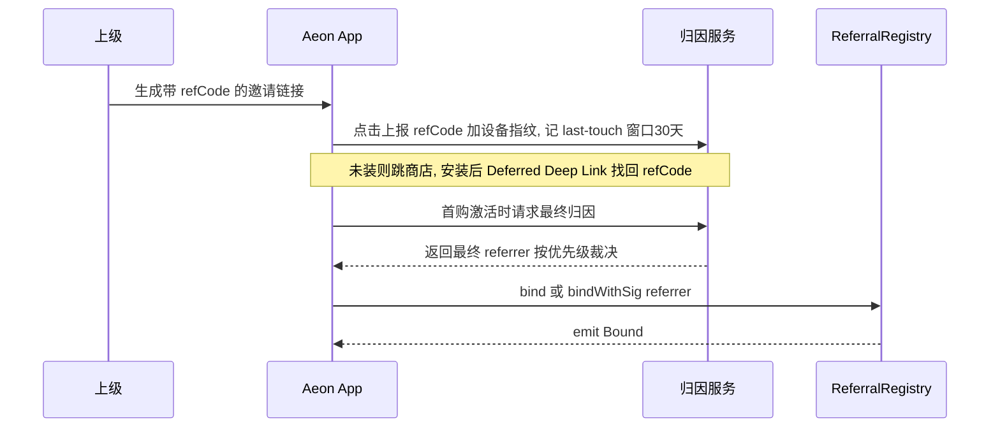
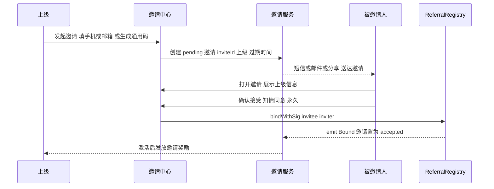
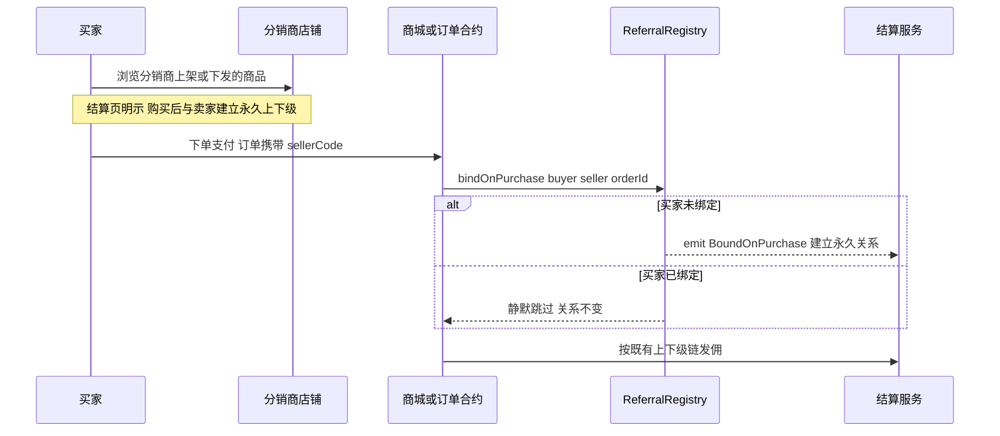
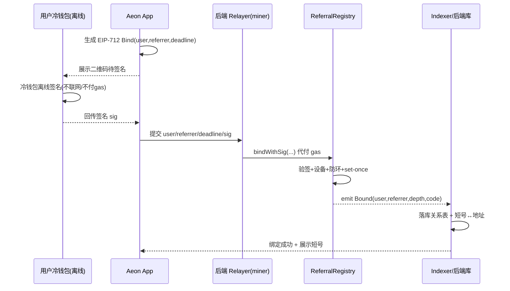
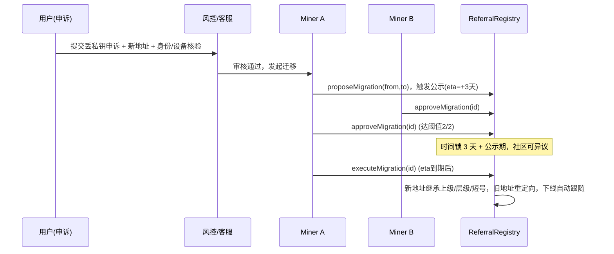

<aside>  
✅

**本轮已确认的关键决策**

1. **丢私钥换地址**：开「多 miner + 时间锁 + 事件公示」的受治理迁移通道（唯一可动关系的口子）。
2. **换机**：钱包地址不变即可（走 DeviceRegistry 换绑设备，上下级不受影响）。
3. **孤儿单**：无上级直购进入「待分配池」，由城市代理/公司认领。
4. **短号**：采用**递增唯一号**（非路径拼接），层级深度无天花板。  
   
   </aside>

## 一、设计目标与「永久不变」三铁律

上下级关系一次绑定、终身锁死，任何人（含 miner、含上级本人）都改不了。落到合约上是三条硬约束：

1. **Set-once**：`referrerOf[user]` 只能写一次，无任何 setter 可改。
2. **无管理员回退**：miner 只能做「初始化创世根 / 代提交用户签名 / 走治理迁移」，**不能任意重绑**。
3. **绑定即锁**：在「首次激活/首购」时刻绑定，成功即写入；退货只冲减佣金，**不解绑关系**。

---

## 二、数据模型

| 字段                          | 含义                    | 可变性           |
| --------------------------- | --------------------- | ------------- |
| `referrerOf[address]`       | 直接上级地址（真身、算钱唯一依据）     | 一次写死，仅治理迁移可平移 |
| `codeOf` / `addrOfCode`     | 递增唯一短号 ↔ 地址（人类可读索引）   | 绑定时一次分配       |
| `depthOf` / `directCountOf` | 层级 / 直推数              | 绑定时写入         |
| `inPendingPool`             | 孤儿待分配标记               | 认领后关闭         |
| `supersededBy[old]`         | 迁移重定向（旧地址→新地址），下线自动跟随 | 迁移执行时写入       |

> **分账只信 `referrerOf`（地址）**，短号绝不参与算钱，避免号码规则漏洞影响资金。

---

## 三、完整合约（参考实现，待审计）

```solidity
// SPDX-License-Identifier: MIT
pragma solidity ^0.8.24;

interface IDeviceRegistry {
    function isBoundAddress(address user) external view returns (bool);
}

/// @title ReferralRegistry
/// @notice 永久不可变的上下级关系（miner 多管理员，无 Ownable）
///  - 递增唯一短号
///  - 孤儿待分配池
///  - 多 miner + 时间锁 + 事件公示 的地址迁移通道
contract ReferralRegistry {
    // ============ miner 多管理员 ============
    mapping(address => bool) public isMiner;
    uint8 public minerCount;
    uint8   public constant MIGRATION_THRESHOLD = 2;      // 迁移所需批准数
    uint256 public constant MIGRATION_DELAY     = 3 days; // 时间锁

    // ============ 核心：永久上下级 ============
    mapping(address => address) public referrerOf;
    mapping(address => bool)    public bound;
    mapping(address => uint32)  public depthOf;
    mapping(address => uint32)  public directCountOf;
    mapping(address => address) public supersededBy; // 迁移重定向 old->new

    // ============ 递增唯一短号 ============
    mapping(address => uint64) public codeOf;
    mapping(uint64  => address) public addrOfCode;
    uint64 public nextCode;

    // ============ 孤儿待分配池 ============
    address public constant PENDING =
        address(uint160(uint256(keccak256("AEON_PENDING_POOL"))));
    mapping(address => bool) public inPendingPool;

    IDeviceRegistry public immutable deviceRegistry;
    address public immutable ROOT;

    // ============ EIP-712（冷钱包离线签名）============
    bytes32 public immutable DOMAIN_SEPARATOR;
    bytes32 public constant BIND_TYPEHASH =
        keccak256("Bind(address user,address referrer,uint256 deadline)");

    // ============ 迁移请求 ============
    struct Migration {
        address from; address to; uint256 eta;
        uint8 approvals; bool executed; bool exists;
    }
    mapping(bytes32 => Migration) public migrations;
    mapping(bytes32 => mapping(address => bool)) public migApproved;

    // ============ 事件（链上公示）============
    event Bound(address indexed user, address indexed referrer, uint32 depth, uint64 code);
    event Orphaned(address indexed user, uint64 code);
    event OrphanClaimed(address indexed user, address indexed newReferrer);
    event MigrationProposed(bytes32 indexed id, address indexed from, address indexed to, uint256 eta);
    event MigrationApproved(bytes32 indexed id, address indexed miner, uint8 approvals);
    event MigrationExecuted(bytes32 indexed id, address indexed from, address indexed to);

    error AlreadyBound(); error SelfRef(); error RefNotRegistered();
    error CycleDetected(); error NotMiner(); error DeviceNotBound();
    error Expired(); error BadSig(); error NotPending();
    error MigNotReady(); error MigExists(); error MigMissing();

    constructor(address root, address device, address[] memory miners, uint64 startCode) {
        ROOT = root;
        deviceRegistry = IDeviceRegistry(device);
        for (uint256 i; i < miners.length; ++i) {
            if (!isMiner[miners[i]]) { isMiner[miners[i]] = true; ++minerCount; }
        }
        nextCode = startCode;          // 例：100000 起发 6 位短号
        _register(root, address(0), 0);// 创世根，无上级

        DOMAIN_SEPARATOR = keccak256(abi.encode(
            keccak256("EIP712Domain(string name,uint256 chainId,address verifyingContract)"),
            keccak256(bytes("AeonReferral")), block.chainid, address(this)
        ));
    }

    modifier onlyMiner() { if (!isMiner[msg.sender]) revert NotMiner(); _; }

    // ---------- 绑定入口 ----------
    function bind(address referrer) external { _bind(msg.sender, referrer); }

    // 冷钱包零 gas：用户离线签 EIP-712，miner/relayer 代提交
    function bindWithSig(address user, address referrer, uint256 deadline, bytes calldata sig)
        external onlyMiner
    {
        if (block.timestamp > deadline) revert Expired();
        bytes32 digest = keccak256(abi.encodePacked("\x19\x01", DOMAIN_SEPARATOR,
            keccak256(abi.encode(BIND_TYPEHASH, user, referrer, deadline))));
        if (_recover(digest, sig) != user) revert BadSig();
        _bind(user, referrer);
    }

    // 无上级 -> 待分配池
    function bindOrphan() external { _bindOrphan(msg.sender); }
    function bindOrphanWithSig(address user, uint256 deadline, bytes calldata sig)
        external onlyMiner
    {
        if (block.timestamp > deadline) revert Expired();
        bytes32 digest = keccak256(abi.encodePacked("\x19\x01", DOMAIN_SEPARATOR,
            keccak256(abi.encode(BIND_TYPEHASH, user, PENDING, deadline))));
        if (_recover(digest, sig) != user) revert BadSig();
        _bindOrphan(user);
    }

    function _bind(address user, address referrer) internal {
        referrer = resolve(referrer);
        if (bound[user])       revert AlreadyBound();      // ★ 永久不变
        if (user == referrer)  revert SelfRef();
        if (!bound[referrer])  revert RefNotRegistered();
        _deviceCheck(user);
        _noCycle(user, referrer);
        _register(user, referrer, depthOf[referrer] + 1);
    }

    function _bindOrphan(address user) internal {
        if (bound[user]) revert AlreadyBound();
        _deviceCheck(user);
        bound[user] = true;
        referrerOf[user] = PENDING;
        inPendingPool[user] = true;
        uint64 c = nextCode++;
        codeOf[user] = c; addrOfCode[c] = user;   // 短号照发，等待认领
        emit Orphaned(user, c);
    }

    // 城市代理/公司认领孤儿（miner 审核后指定上级）
    function claimOrphan(address user, address newReferrer) external onlyMiner {
        if (!inPendingPool[user]) revert NotPending();
        newReferrer = resolve(newReferrer);
        if (!bound[newReferrer]) revert RefNotRegistered();
        _noCycle(user, newReferrer);
        referrerOf[user] = newReferrer;
        depthOf[user] = depthOf[newReferrer] + 1;
        inPendingPool[user] = false;
        unchecked { directCountOf[newReferrer] += 1; }
        emit OrphanClaimed(user, newReferrer);
    }

    // ---------- 迁移通道：多 miner + 时间锁 + 事件公示 ----------
    function proposeMigration(address from, address to) external onlyMiner returns (bytes32 id) {
        if (!bound[from] || bound[to]) revert MigMissing();
        id = keccak256(abi.encode(from, to));
        Migration storage m = migrations[id];
        if (m.exists && !m.executed) revert MigExists();
        migrations[id] = Migration(from, to, block.timestamp + MIGRATION_DELAY, 0, false, true);
        emit MigrationProposed(id, from, to, migrations[id].eta);
    }

    function approveMigration(bytes32 id) external onlyMiner {
        Migration storage m = migrations[id];
        if (!m.exists || m.executed) revert MigMissing();
        if (!migApproved[id][msg.sender]) {
            migApproved[id][msg.sender] = true;
            ++m.approvals;
            emit MigrationApproved(id, msg.sender, m.approvals);
        }
    }

    function executeMigration(bytes32 id) external onlyMiner {
        Migration storage m = migrations[id];
        if (!m.exists || m.executed) revert MigMissing();
        if (block.timestamp < m.eta || m.approvals < MIGRATION_THRESHOLD) revert MigNotReady();
        if (bound[m.to]) revert AlreadyBound();

        // 新地址继承上级/层级/短号；旧地址作废并重定向（下线自动跟随）
        referrerOf[m.to]    = referrerOf[m.from];
        depthOf[m.to]       = depthOf[m.from];
        directCountOf[m.to] = directCountOf[m.from];
        bound[m.to]         = true;
        uint64 c = codeOf[m.from];
        codeOf[m.to] = c; addrOfCode[c] = m.to;

        supersededBy[m.from] = m.to;
        bound[m.from] = false;
        codeOf[m.from] = 0;
        m.executed = true;
        emit MigrationExecuted(id, m.from, m.to);
    }

    // ---------- 读取 ----------
    function resolve(address a) public view returns (address) {
        for (uint256 i; i < 8; ++i) {          // 跟随迁移重定向
            address n = supersededBy[a];
            if (n == address(0)) break;
            a = n;
        }
        return a;
    }

    function getUplines(address user, uint256 n) external view returns (address[] memory ups) {
        ups = new address[](n);
        address cur = resolve(referrerOf[resolve(user)]);
        for (uint256 i; i < n; ++i) {
            ups[i] = cur;
            if (cur == address(0) || cur == ROOT || cur == PENDING) break;
            cur = resolve(referrerOf[cur]);
        }
    }

    // ---------- 内部 ----------
    function _register(address user, address referrer, uint32 depth) internal {
        referrerOf[user] = referrer;
        bound[user] = true;
        depthOf[user] = depth;
        if (referrer != address(0)) unchecked { directCountOf[referrer] += 1; }
        uint64 c = nextCode++;
        codeOf[user] = c; addrOfCode[c] = user;
        emit Bound(user, referrer, depth, c);
    }

    function _deviceCheck(address user) internal view {
        if (address(deviceRegistry) != address(0) && !deviceRegistry.isBoundAddress(user))
            revert DeviceNotBound();
    }

    function _noCycle(address user, address referrer) internal view {
        address cur = referrer;
        for (uint256 i; i < 128; ++i) {
            if (cur == user) revert CycleDetected();
            if (cur == ROOT || cur == PENDING || cur == address(0)) break;
            cur = referrerOf[cur];
        }
    }

    function _recover(bytes32 d, bytes calldata sig) internal pure returns (address a) {
        if (sig.length != 65) revert BadSig();
        bytes32 r; bytes32 s; uint8 v;
        assembly {
            r := calldataload(sig.offset)
            s := calldataload(add(sig.offset, 32))
            v := byte(0, calldataload(add(sig.offset, 64)))
        }
        a = ecrecover(d, v, r, s);
    }
}
```

---

## 四、两种模式对比

| 维度    | 方案 A：合约地址绑定（本方案主库） | 方案 B：短号（递增唯一号 · 索引层） |
| ----- | ------------------ | -------------------- |
| 上下级真身 | `referrerOf` 地址映射  | 不定上下级，仅唯一 ID         |
| 算钱依据  | **是**（唯一依据）        | 否（不参与）               |
| 层级深度  | 无限制                | 无限制（递增号，非路径）         |
| 用途    | 分账、审计、防篡改          | 推广码、海报、客服检索、UI 展示    |

> 结论：**A 为权威 + B 为索引**，两层都在绑定时一次写死。放弃「短号拼接编码层级」是因为它有宽度/深度天花板，与你确定的「递增唯一号、深度不设限」冲突。

---

## 五、App / 后端实施流程

绑定 = **发现上级（触发渠道）→ 用户知情确认 → 上链写入（热/冷钱包）** 三段。触发渠道有 5 类，最终都汇聚到同一个上链层（5.7）。

### 5.1 绑定触发渠道总览

| 渠道               | 适用场景            | 信号强度   | 归因方式            |
| ---------------- | --------------- | ------ | --------------- |
| 扫码绑定             | 面对面、门店、地推、展会    | 强（当面）  | 即时              |
| 邀请链接 / Deep Link | 私域、社群、朋友圈裂变     | 中      | 归因窗口 last-touch |
| 主动邀请（邀请模块）       | 定向拉新、KOL/代理批量邀请 | 强（点对点） | pending 邀请      |
| **购买即绑定** ★      | 买了代理/上架商品、直播下单  | 最强（成交） | 订单成交归属          |
| 兜底孤儿             | 无任何来源           | 无      | 待分配池（第七节）       |

> **短号（方案 B）贯穿全渠道**：refCode、邀请码、sellerCode、海报、客服检索都用短号；但**绑定与算钱只认地址**，短号只做人找人。

### 5.2 归因裁决与知情确认（永久绑定的前置闸门）

因为关系 set-once 永久，必须在**唯一确认点（首购激活 / 结算页）**做一次知情确认；多信号冲突时，用确定性优先级预填候选上级：

1. 本次购买的商品归属分销商（成交信号最强）
2. 本次会话内显式扫码 / 接受的定向邀请
3. 邀请链接 / Deep Link 归因（窗口 30 天，last-touch）
4. 无 → 进孤儿待分配池

<aside>  
⚖️

**三条铁律**

- 链上 `bind` 一旦成功即 set-once 锁死，之后任何渠道信号都不再改写。
- 结算/激活页必须明示「将与 XX 建立**永久**上下级关系」，用户确认后才上链（合规 + 防纠纷）。
- 全渠道统一带**设备指纹校验**，防女巫 / 自建下线。  
  
  </aside>

### 5.2.1 Tab 3 团队加入流程优化（2026-07-14 决策，2026-07-17 迭代）

**背景**：原方案设备指纹绑定（DeviceRegistry）作为前置校验，用户必须先在 Tab 2 保险库绑定设备指纹并上链激活后才能使用 Tab 3 团队功能。实际落地时发现此流程过重，且下级用户可能没有 gas 币无法签订合约。

**核心决策**：

1. **设备指纹后置上链**：不再前置检测白名单。设备指纹绑定和上下级关系绑定在"确认加入"时一起完成。Tab 3 进入后只检测 `referrerOf` 是否已设置（两层准入：未加入团队 → 初始页 / 已加入 → 主页）。

2. **申请-审批-gas转账-确认 完整流程**：为解决下级无 gas 无法签订合约的问题，改为下级主动发起申请 → 上级审批同意并向下级转账 gas（默认最小 0.05，可自定义）→ 下级收到 gas 后确认加入（设备指纹绑定 + 关系绑定一起完成）。

3. **三种加入方式**：
   - 扫码加入：扫描已加入成员的二维码
   - 搜索短号：输入短号查找上级（唯一搜索方式）
   - 等待邀请：被动等待已有成员邀请

4. **邀请能力白名单验证（懒验证）**：二维码展示、邀请发送、团队申请三个功能在点击时触发合约白名单验证，未通过弹窗提示（原型暂只做提示，实际校验由白名单合约完成）。不在进入推广中心时验证，避免过度拦截。

5. **推广中心重构**：记录按钮改为「团队申请」双 Tab（我邀请的 / 加我的），合并主动邀请和接收申请两类记录。主动邀请和接收申请的 gas 转账流程对称，但 gas 转账不作为状态机一环，是否成功由链上校验；审批/邀请时可选"不发送 gas"。命名考究：参考微信"新的朋友"语义，"团队申请"同时覆盖主动邀请（等待对方同意）和被动接收（需我审批）两类，比"申请管理"更准确，且 Tab 简化为「我邀请的 / 加我的」对齐主流 IM 句式。

**2026-07-17 迭代优化（本轮）**：

1. **申请进度页精简**：
   - 不展示 gas 到账金额信息（gas 仅作为流程中间态，不对用户暴露具体数值）
   - "立即确认上链"按钮改为"确认加入"
   - 删除独立的"确认上链签名"二级页面，将确认加入的详情（设备指纹绑定 + 关系绑定）和终身不可改提示直接展示在申请进度页的"已同意"分支中
   - 用户点击"确认加入"直接触发 EIP-712 签名上链

2. **短号搜索流程简化**：
   - 短号搜索为唯一搜索方式，搜索命中后直接在结果页展示上级信息卡 + 绑定信息 + 提示 + "发送申请"按钮
   - 不再做二级确认页面，减少页面跳转
   - 扫码流程保留独立的确认上级信息页（扫码是一级动作，识别后展示确认信息合理）

3. **邀请流程与 gas 转账解耦**：
   - 主动邀请与接收申请的 gas 转账流程对称，但 gas 转账不作为邀请/申请状态机的一环
   - gas 转账是否成功由链上校验，不混入邀请/申请状态机中（一般情况下一定能成功，若未成功也是链上校验的事情）
   - 邀请/申请审批时，发起方可选择"不发送 gas"（仅接受/同意，不转账，由下级自行解决 gas）
   - 邀请记录状态机回归三态：待接受 / 已绑定 / 已拒绝 / 已过期（无 待转gas / 已转gas 中间态）
   - 申请审批页提供三按钮：拒绝 / 接受·不转gas / 接受·转gas；并提供"不发送 gas"勾选项
   - 申请进度页"已同意"分支提示：若上级未转 gas，下级需自行准备 gas 完成上链

4. **「团队申请」命名定稿与状态文案优化**：
   - 推广中心第三个入口从「申请管理」更名为「团队申请」（参考微信"新的朋友"语义，"团队申请"同时覆盖主动邀请和被动接收两类，比"申请管理"更准确）
   - 双 Tab 从「我邀请的 / 申请加我的」简化为「我邀请的 / 加我的」（对齐主流 IM"我发出的/我收到的"句式）
   - "加我的"Tab 中已同意状态从「已同意+转gas，等待对方确认」简化为「已同意·待对方确认」（gas 是否转账不作为状态描述，符合"g 转账不混入状态机"决策）
   - 审批页底部按钮从三按钮回归两按钮「拒绝 / 接受」，是否转 gas 由上方"不发送 gas"勾选项决定
   - 邀请发起页加回 gas 预设区（默认勾选"不发送 gas"，取消勾选后可自定义金额），与审批页对称

**流程图**：
```
【下级主动申请流程】                        【上级被动接收申请流程】
下级(申请人)                          上级(审批人)
    │  1. 扫码/搜索找到上级                │
    │  2. 确认上级信息                     │
    │  3. 发送申请(不上链)                 │
    │────────────────────────────────────→│
    │                                     │  4. 收到申请通知(推广中心·团队申请)
    │                                     │  5. 审批：接受/拒绝
    │                                     │  6. 接受 → 可选转 gas(默认0.05可自定义/可不转)
    │←────────────────────────────────────│
    │  7a. 成功：上级已同意                │
    │      → 申请进度页直接展示确认详情     │
    │      → 点击"确认加入"                │
    │      → EIP-712签名(设备指纹+关系绑定) │
    │  7b. 失败：上级拒绝                  │
    │      → 提示页 → 可重新申请           │
    │  8. 上链成功 → 进入团队主页           │

【上级主动邀请流程】                        【下级被动接收邀请流程】
上级(邀请人)                          下级(被邀请人)
    │  1. 输入对方地址 + 预设gas金额        │
    │  2. 发起邀请签名(不上链)             │
    │────────────────────────────────────→│
    │                                     │  3. 收到邀请通知
    │                                     │  4. 接受/拒绝邀请
    │←────────────────────────────────────│
    │  5. 对方已接受 → 状态变"已接受"       │
    │  6. 邀请方可选转账 gas(可不转)        │
    │────────────────────────────────────→│
    │                                     │  7. 确认加入
    │                                     │     → EIP-712签名上链
    │  8. 状态变"已绑定"                   │  8. 关系绑定完成
```

**2026-07-20 迭代优化（短号区重构）**：

1. **上级层级命名约定（LX/LY）**：
   - **LX** = 上上级（grandparent，离我更远的一级）
   - **LY** = 上级（parent，我的直接上级）
   - **链路格式**：`LX.LY`（如 `100000.100028`，上上级.直接上级）
   - 推广中心顶部"上级短号"卡显示 LY（直接上级）；弹窗按 LX → LY 顺序展示两级
   - 注意：此处的 LX/LY 是上级链路命名，与分销体系下级深度 L1/L2/L3（直推/间接下线）是不同语义，不冲突

2. **推广中心短号区从三段式改为两段式**：
   - 左：**上级短号卡**（短号链路较长，5-8 位 × 两级）—— 展示 LY 直接上级短号，点击"查看链路"弹窗，弹窗内按 LX → LY 顺序展示上上级 + 直接上级 两级（不展示更深层级），底部说明链路格式 `LX.LY`（如 100000.100028）
   - 右：**我的短号卡** —— 展示当前选中的展示短号 + 类型徽章（💎 靓号 / 🎁 免费号），点击"管理"进入我的短号管理子页
   - 不再独立展示上级姓名/地址/绑定时间，精简为短号链路弹窗承载

3. **短号服务复用而非迁移**：
   - Tab3 的"我的短号"管理子页**复用** DID 身份页的短号服务设计，DID 那边的短号功能**保留**
   - 两处入口共用同一套短号注册/定价/领取规则，便于维护

4. **多短号支持 + 展示短号切换**：
   - 一个身份可绑定多个短号（多个靓号 + 1 个免费号）
   - 同一时间只有一个"展示短号"，影响推广中心顶部展示和推广二维码展示
   - 切换展示短号**不影响链上绑定关系**，仅影响 UI 展示
   - 数据模型扩展：`myShortNumbers: [{ number, type(premium/free), subType, acquiredAt, chain, isDisplaying }]`

5. **我的短号管理子页三 Tab**（复用 DID 短号服务设计）：
   - **💾 我的短号**：列出已绑定的全部短号，每张卡片显示类型徽章 + 获取日期 + 链，可"设为展示"
   - **💎 购买靓号**：查价输入框（5-8 位纯数字）+ 位数筛选 Pills（5/6/7/8）+ 推荐列表（换一批）+ 定价规则折叠区 + 支付确认弹窗（网络/币种/PIN）
   - **🎁 免费号**：随机生成 10 个 10-12 位候选号（自动避开靓号段）+ 换一批 + 领取选中号；每个身份仅可免费领取 1 次

6. **靓号定价规则**（复用 DID，全链统一）：
   - 普通号基价：5位 1000 USDT 买断，位数每多一位 ×0.9（6位900 / 7位810 / 8位729）
   - 倍率：豹子(全同)×50 / 顺子(连号)×20 / 四连同(4重)×10 / 葫芦(三连+对)×8 / 双对子×5 / 吉尾号(尾6/8)×3 / normal×1
   - 免费号：随机 10-12 位，自动避开所有靓号段

### 5.3 渠道一 · 扫码绑定（面对面）

**前端**

1. 上级在「我的推广」出示二维码（内含 refCode = 短号或地址）。
2. 被邀请人扫码 → App 解析 refCode → 归因服务标记 last-touch = 扫码（强）。
3. 首购激活页展示上级信息 → 确认。

**链上**：走 5.7 统一上链层（`bind` 或 `bindWithSig`）。

**适用**：地推、门店、展会等面对面场景。

### 5.4 渠道二 · 邀请链接 / Deep Link（远程 + 安装归因）

- 上级在 App 生成带 refCode 的邀请链接 / 短链 / 海报二维码。
- 点击后：已装 App → Universal/App Link 直接唤起并带 refCode；未装 → 跳应用商店，安装后首开用 **Deferred Deep Link**（SDK 指纹匹配）找回 refCode。
- 归因服务记录 `(refCode, 设备指纹, 时间)`，30 天窗口 last-touch；绑定延后到首购激活，届时按 5.2 裁决。



**适用**：私域、社群、朋友圈裂变。

### 5.5 渠道三 · 主动邀请模块（发送邀请，独立模块）

独立「邀请中心」模块：

- **我的邀请**：邀请码、专属链接、海报，可填手机号/邮箱**定向邀请**。
- **邀请状态机**：`created → sent → clicked → registered → activated(bound)`，或 `expired`。
- **邀请奖励**：被邀请人**激活绑定后**才发奖（挂钩激活，不挂钩点击/注册，防刷）。
- **后端**：邀请服务维护 pending 邀请表 `(inviteId, inviter, 目标, 过期, 状态)`；接受时调用统一上链层。



**适用**：定向拉新、KOL / 代理批量邀请。

### 5.6 渠道四 · 购买即绑定（代理 / 上架商品）★

**核心逻辑**：买家购买某分销商**上架 / 下发**的商品，成交即把（未绑定的）买家绑到该分销商，成为其下级。这是最强的成交型获客，也是你要补的关键渠道。

**规则**

- 每个 SKU / 店铺带 `sellerCode`（卖家短号或地址），下单时随订单携带。
- 结算合约在成交时**原子调用** `bindOnPurchase(buyer, seller, orderId)`：
  - 买家未绑定 & 卖家有效 → 建立**永久**关系。
  - 买家已绑定 → **静默跳过**（不 revert，关系不变），佣金仍按其既有链发放。
  - 卖家无效 / 自购 → 静默跳过（可选转孤儿池）。
- 结算页必须明示「购买后与卖家建立永久上下级」。

**合约扩展**（在第三节 `ReferralRegistry` 基础上追加授权调用者白名单，仅商城/结算合约可发起购买绑定）：

```solidity
// —— 在第三节 ReferralRegistry 基础上追加 ——

// 授权调用者（仅商城/结算合约可发起购买绑定）
mapping(address => bool) public authorizedBinder;
error NotAuthorized();

event AuthorizedBinderSet(address indexed caller, bool allowed);
event BoundOnPurchase(address indexed buyer, address indexed seller, uint256 indexed orderId);

modifier onlyAuthorized() {
    if (!authorizedBinder[msg.sender]) revert NotAuthorized();
    _;
}

// 授权治理（建议同样过多签/时间锁，此处示意从简）
function setAuthorizedBinder(address caller, bool allowed) external onlyMiner {
    authorizedBinder[caller] = allowed;
    emit AuthorizedBinderSet(caller, allowed);
}

// 购买即绑定：商城/结算合约成交时原子调用
// 买家已绑定 -> 静默跳过（不 revert，保证下单不失败，关系永久不覆盖）
function bindOnPurchase(address buyer, address seller, uint256 orderId)
    external onlyAuthorized
{
    if (bound[buyer]) return;                       // 已绑定，关系永久，不覆盖
    seller = resolve(seller);
    if (buyer == seller || !bound[seller]) return;  // 卖家无效或自购，跳过
    if (address(deviceRegistry) != address(0) && !deviceRegistry.isBoundAddress(buyer)) return;
    _register(buyer, seller, depthOf[seller] + 1);
    emit BoundOnPurchase(buyer, seller, orderId);
}
```



**适用**：分销商带货、官方商城代理专区、直播/私域下单。

### 5.7 统一上链层：热钱包自绑 vs 冷钱包离线签名

所有渠道最终都汇聚到同一上链层——归因服务先算出**最终 referrer**，再二选一上链：

- **热钱包自绑**：App 内轻钱包/桥接钱包直接发 `bind(referrer)`（用户自付或桥代付 gas）。
- **冷钱包离线签名（推荐，零 gas）**：用户离线签 EIP-712，Relayer(miner) 代提交 `bindWithSig`。



### 5.8 后端组件与数据流

| 组件                | 职责                                                                                              |
| ----------------- | ----------------------------------------------------------------------------------------------- |
| 归因服务（Attribution） | 汇聚扫码/链接/邀请/购买各信号，按 5.2 优先级算出最终 referrer                                                         |
| 邀请服务（Invitation）  | 维护 pending 邀请、状态机、邀请奖励结算                                                                        |
| 商城 / 订单合约（Mall）   | 成交时携带 sellerCode，原子调用 `bindOnPurchase`                                                          |
| Relayer / Bridge  | 持 miner key，代提交 `bindWithSig` / 治理交易并代付 gas                                                     |
| Indexer           | 监听 Bound/BoundOnPurchase/Orphaned/OrphanClaimed/Migration* 事件，同步关系表（建议物化 closure table 便于查 N 级） |
| DeviceRegistry 服务 | 设备指纹绑定，与关系绑定一起在确认上链时完成（反女巫/反自建下线，不再前置检测）                                                                        |
| 结算服务              | 按事件 + 销售流水计算 L1/L2/L3 佣金与年费分润                                                                   |

### 5.9 反作弊与边界

- **防抢单**：链接归因可被更强信号覆盖，防分销商用链接抢别人的成交单；购买绑定只对**未绑定**买家生效，杜绝改上级洗单。
- **防自建下线**：全渠道设备指纹去重，一人无法自建多层下线。
- **防刷邀请**：邀请奖励挂钩「激活绑定」而非「点击/注册」。
- **可回放**：所有渠道统一走知情确认 + set-once，纠纷凭链上事件（Bound / BoundOnPurchase）回放。

---

## 六、迁移通道流程（丢私钥换地址）



- 只有此通道能「动」关系，且需 **≥2 miner 批准 + 3 天时间锁 + 全程链上事件公示**。
- 下线无需逐个改：靠 `supersededBy` 重定向，读取时 `resolve()` 自动跟随。

---

## 七、孤儿待分配流程

1. 用户无上级直购 → `bindOrphan` / `bindOrphanWithSig`，关系挂 `PENDING`，**短号照发**、`emit Orphaned`。
2. 进入后台「待分配池」，城市代理/公司在规则内认领。
3. miner 审核后 `claimOrphan(user, newReferrer)` 指定上级 → `emit OrphanClaimed`。
4. 认领同样走防环校验，认领后关系即锁死、不可再改。

---

## 八、佣金结算读取

- 结算合约在发佣时 `getUplines(buyer, 3)` 拿到 L3→L2→L1，按方案页 20/14/10 + 7/6 + 2 分账，全链可回放。
- 绑定时刻 = **首购激活**：一次激活原子完成「设备绑定 + 上下级绑定 + 短号分配」。
- 退货只在结算侧冲减/回滚佣金，**不动 `referrerOf`**——关系永久、钱可回退。

---

## 九、边界与风控

- **地址即身份**：私钥丢失走第六节治理迁移，是唯一可动关系的口子。
- **换机**：地址不变，走 DeviceRegistry 换绑设备，不影响上下级。
- **防自建下线**：绑定强制设备指纹校验 + 防环 + set-once。
- **合规**：迁移/认领全程事件公示，佣金 100% 挂钩实际流水，无预付、无强制囤货。

---

## 十、下一步

- [ ] 合约送审计（重点：迁移重定向 resolve 循环、EIP-712 重放、孤儿认领权限）。
- [ ] 确定 miner 阈值（现设 2）、时间锁时长（现设 3 天）、短号起始位数（现设 6 位）。
- [ ] Indexer closure table 表结构与结算服务对接口径。