# Node 产品商业架构蓝图设计方案 v2.0

> **版本**:v2.0(精简重构版,取代 v1.0 大而全版)
> **日期**:2026-08-04
> **编制**:PM(AI 协助)
> **状态**:设计方案,待团队评审
> **依据**:v1.0 方案、《功能定版清单-2026-07-31》、各模块合约源码与方案文档
> **v2.0 变更**:从"大而全商业宣讲"转向"模块耦合 + 参与者视角";砍除已定内容(护城河/竞品/B 端运营细节/三大飞轮独立章节);新增参与者地图与身份路径;核心图改用 Mermaid 思维导图与流程图;演进只列预留点位置不展开 v2.0 细节

---

## 一、设计原则(v2.0 调整说明)

### 1.1 v1.0 的问题

v1.0 共 15 章,存在三个问题:
1. **大而全**:护城河、竞品对比、B 端运营、网络效应等已定内容重复占用篇幅
2. **参与者缺失**:只讲"模块怎么连",没讲"谁触发、谁受益、谁审核"
3. **演进过细**:v2.0 远期细节(租赁/荷兰拍/集邮挖矿)占位过多,挤占当下焦点

### 1.2 v2.0 原则

| 原则 | 说明 |
|---|---|
| 聚焦耦合 | 只画模块间"谁调谁、谁依赖谁",商业逻辑只在耦合处一句话点出 |
| 参与者显性化 | 每个模块标注触发方 / 受益方 / 审核方 |
| 多留白 | 已定内容不重述(引用 v1.0 即可),演进只列预留点位置 |
| 图重于文 | 核心用 Mermaid 思维导图与流程图,文字只做注解 |
| 不重复 | 同一信息只在一处维护,其他引用编号 |

### 1.3 与 v1.0 的对照

| v1.0 章节 | v2.0 处理 |
|---|---|
| 一、设计目标 | 精简为原则说明 |
| 二、产品全景定位 | 砍除(已定,见产品手册) |
| 三、六大商业引擎 | 砍除(已定,引用即可) |
| 四、分层架构 | 保留,改为思维导图 |
| 五、三大飞轮 | 砍除独立章节,合并到耦合链路注解 |
| 六、三大流闭环 | 精简,只保留资金流时序 1 张 |
| 七、模块关联矩阵 | **升级为核心章节**,新增参与者标注 |
| 八、代币体系 | 砍除(已定,见产品手册) |
| 九、合约体系映射 | 保留,合并到耦合链路 |
| 十、商业护城河 | 砍除(已定) |
| 十一、演进路径 | 精简为预留点表格 |
| 十二、B 端运营 | 砍除(已定,见服务管理后台方案) |
| 十三、竞品差异化 | 砍除(已定) |
| 十四、待讨论事项 | 保留 |
| — | **新增**:参与者地图、参与者业务路径 |

---

## 二、参与者地图(新增核心维度)

> 蓝图不仅要讲"模块怎么连",更要讲"谁在用"。同一模块对不同参与者意义不同,需显式标注。

### 2.1 参与者全景思维导图

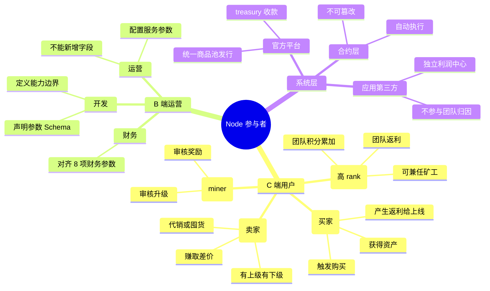

### 2.2 参与者能力边界

| 参与者 | 能做 | 不能做 | 利益来源 |
|---|---|---|---|
| **普通用户** | 购买商品、绑定上级、持有资产、流转处置 | 上架商品、领取团队返利 | 自身购买奖励、资产增值 |
| **代理** | 上述全部 + 代销/囤货、改价、补货、下架 | 越级看商品池(严格层级) | 代销差价 + 下级购买返利 |
| **团长** | 上述全部 + 团队积分累加、3 层团队返利 | 跳过等级 compression | 团队返利(沿 E 链 3 层) |
| **矿工** | 审核升级申请、获得审核奖励 | 自审自己 | 审核奖励 |
| **运营** | 配置产品参数、管理商品上架、查看数据 | 新增字段、改合约逻辑 | 平台薪资 |
| **财务** | 对齐 8 项参数、校准金额 | 改业务逻辑 | 平台薪资 |
| **开发** | 定义服务能力、声明 Schema、部署合约 | 改线上参数、改业务规则 | 平台薪资 |
| **官方平台** | 统一发行商品、treasury 收款、空投 | 托管私钥、改链上关系 | 货款 + 手续费 |
| **应用第三方** | 上架应用、获得 CPS 抽成 | 参与团队归因、触达关系层 | CPS 抽成 + 上架费 |

### 2.3 身份叠加规则(同一地址可兼任)

| 兼任组合 | 触发条件 | 利益叠加 |
|---|---|---|
| 普通用户 + 代理 | 有上级且自身有下级 | 买时代理赚差价,卖时赚团队返利 |
| 团长 + 矿工 | rank ≥ 阈值(待定) | 团队返利 + 审核奖励 |
| 官方 + 商家 | 平台自营商品 | treasury 收款 + 商品利润 |
| 代理 + 矿工 | 代理 rank 达标 | 代销差价 + 审核奖励 |

> **关键**:身份不是注册出来的,是链上状态自动判定的。地址的 rank、上下级关系、持仓决定了它当下是哪个身份,合约层无歧义。

---

## 三、功能模块全景(思维导图)

> 按**商业职能分层**(L1-L7),非按 Tab 分层。Tab 是用户视角,分层是架构视角。

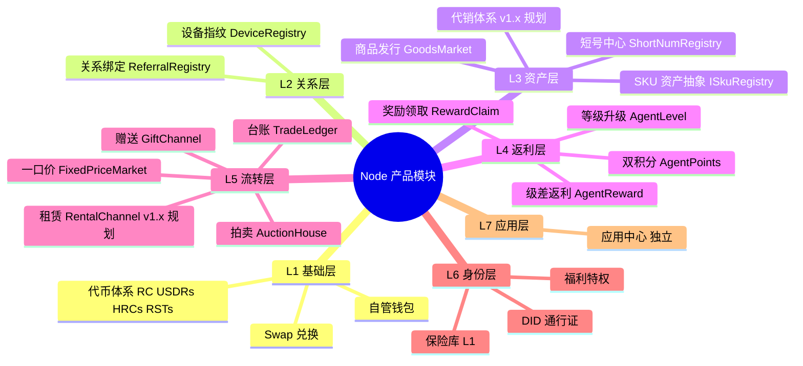

### 3.1 分层依赖铁律

- **上层依赖下层,下层不感知上层**(单向依赖)
- L2 关系层是分水岭:L1+L2 构成"信任基座",L3-L5 构成"商业引擎",L6-L7 构成"生态扩展"
- L7 应用中心**独立于 L2-L6**,不参与关系与分润(合规防火墙)

---

## 四、模块耦合关系(核心章节)

### 4.1 模块依赖总图

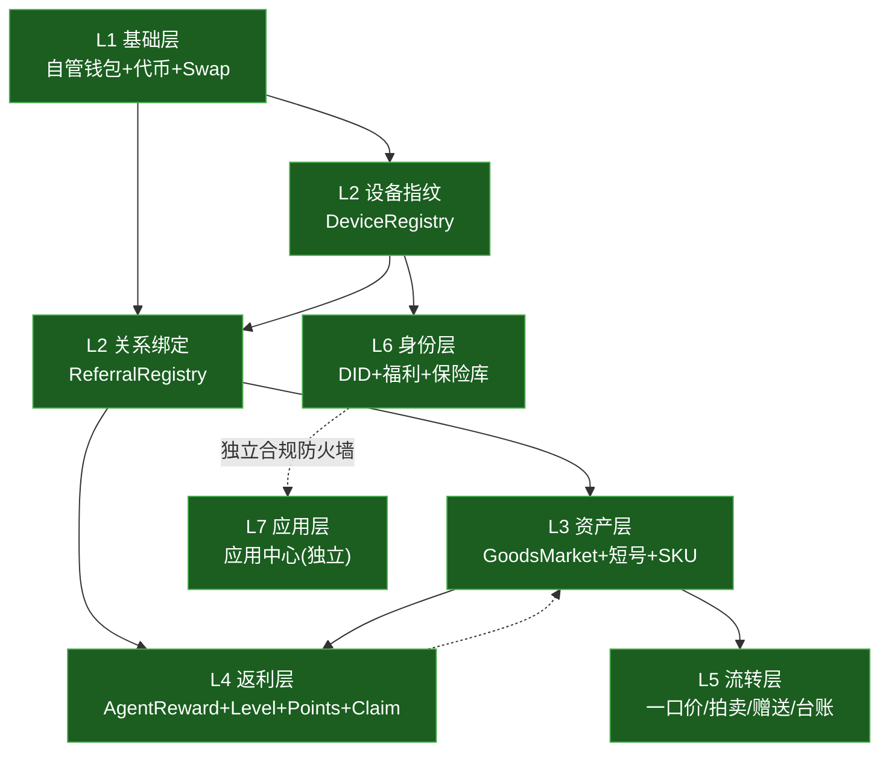

### 4.2 八条核心耦合链路(最易出问题)

> 每条链路标注:触发方 → 涉及模块 → 受益方,审核方单独标注

#### 链路 1:购买 → 返利(最高频)

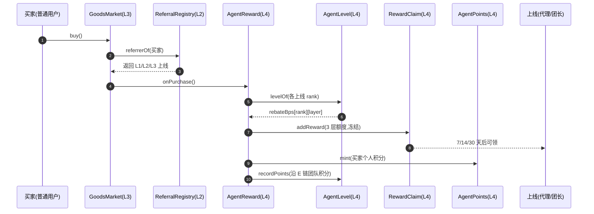

- **触发方**:买家(普通用户)
- **受益方**:3 层上线(代理/团长)+ 买家自身
- **风险点**:返利计算错误、compression 失效

#### 链路 2:退货 → 撤返利(P0/P1 漏洞高发区)

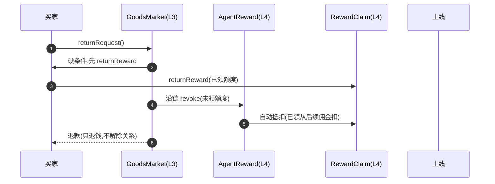

- **触发方**:买家
- **审核方**:合约自动(compression 链路)
- **受益方**:平台(避免双重支付)
- **关键铁律**:退货只退钱,**不解除关系**

#### 链路 3:关系绑定 → 设备指纹(全 App 闸门)

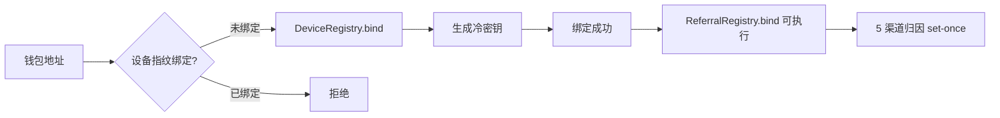

- **触发方**:新用户
- **审核方**:DeviceRegistry(物理层排他)
- **受益方**:上级(获得归因)
- **风险点**:绕过设备指纹直接绑定

#### 链路 4:购买即绑定(bindOnPurchase)

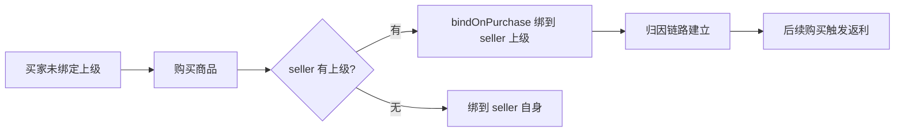

- **触发方**:买家(隐式)
- **受益方**:seller 的上线
- **风险点**:bindOnPurchase 逻辑错误导致归因错位

#### 链路 5:升级 → 返利比例变化

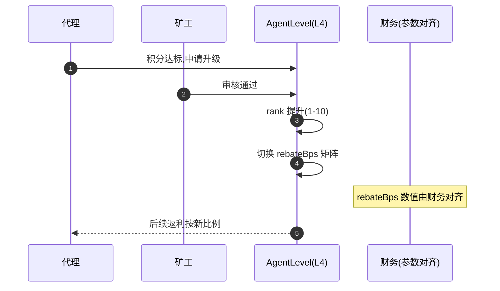

- **触发方**:代理(申请)
- **审核方**:矿工
- **受益方**:代理(返利比例提升)
- **风险点**:rank 提升后 rebateBps 取错行

#### 链路 6:资产化 → 流转

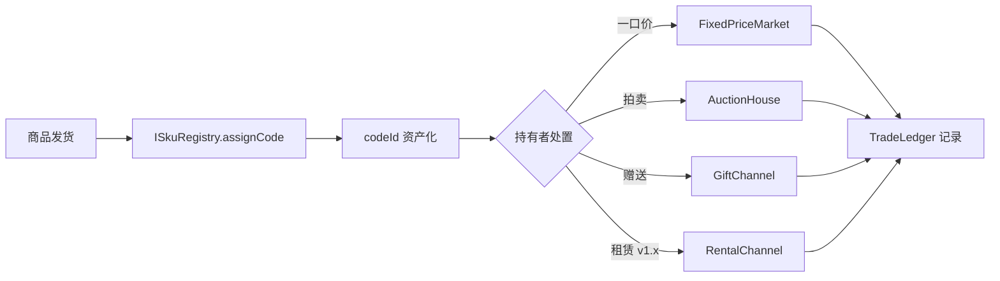

- **触发方**:持有者(任意身份)
- **受益方**:买家(二级市场)
- **风险点**:资产状态不一致(已挂单又发货)

#### 链路 7:团队积分累加(防空团长)

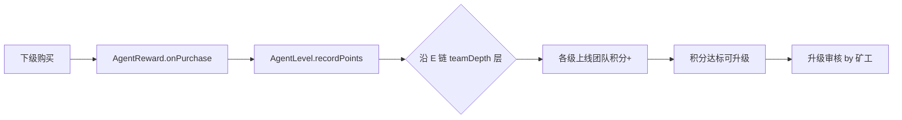

- **触发方**:下级(隐式)
- **受益方**:各级上线(团队积分)
- **风险点**:沿 E 链累加层数错误

#### 链路 8:跨渠道锁(防重复挂单)

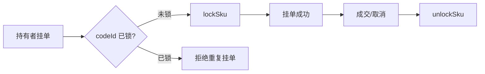

- **触发方**:持有者
- **审核方**:合约(lockSku)
- **风险点**:已由 lockSku 解决

### 4.3 模块耦合强度矩阵(精简版)

| 模块 | 主要依赖 | 主要输出 | 耦合强度 |
|---|---|---|---|
| L1 自管钱包 | 无(基座) | 地址、余额、Swap | 基础 |
| L2 设备指纹 | L1 地址 | 绑定校验、冷密钥 | 🔴 最高(全 App 闸门) |
| L2 关系绑定 | L2 设备指纹、L1 地址 | 上线链、5 渠道归因 | 🔴 最高(分润依据) |
| L3 商品发行 | L2 设备指纹、L2 关系 | codeId、订单、购买事件 | 🔴 高(触发返利) |
| L4 级差返利 | L2 关系链、L3 事件、L4 等级 | RewardClaim 额度 | 🔴 最高(资金分流) |
| L5 流转市场 | L3 codeId、L1 钱包 | 二级成交、台账 | 🟡 中(不触发返利) |
| L6 保险库 | L1 钱包、设备硬件 | 安全闸门、冷密钥 | 🔴 最高(全 App 基座) |
| L7 应用中心 | L1 钱包(可选) | 应用下载、CPS 抽成 | 🟢 低(独立) |

> 完整 12 模块矩阵见 v1.0 第 7.2 节,此处只列核心 8 模块耦合强度。

---

## 五、参与者业务路径(新增)

> 同一蓝图,不同参与者看到的路径不同。下面四张图分别从普通用户、代理、团长、矿工视角梳理。

### 5.1 普通用户路径

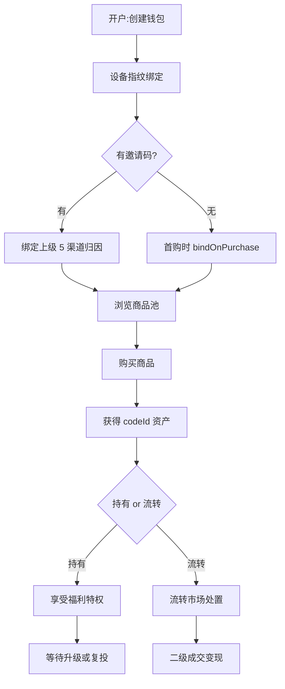

### 5.2 代理路径

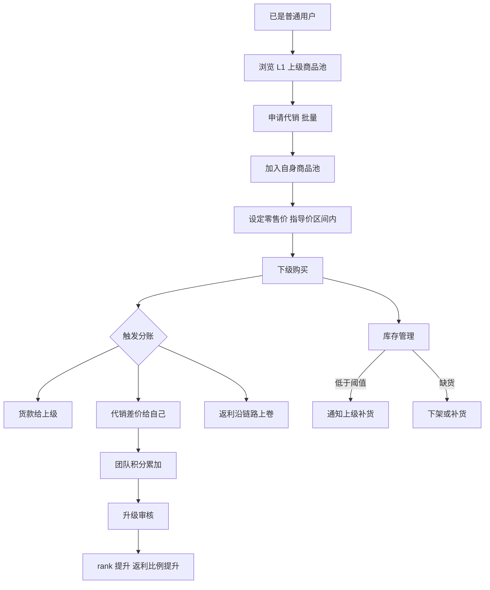

### 5.3 团长路径

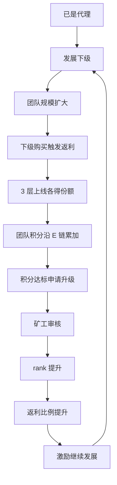

### 5.4 矿工路径

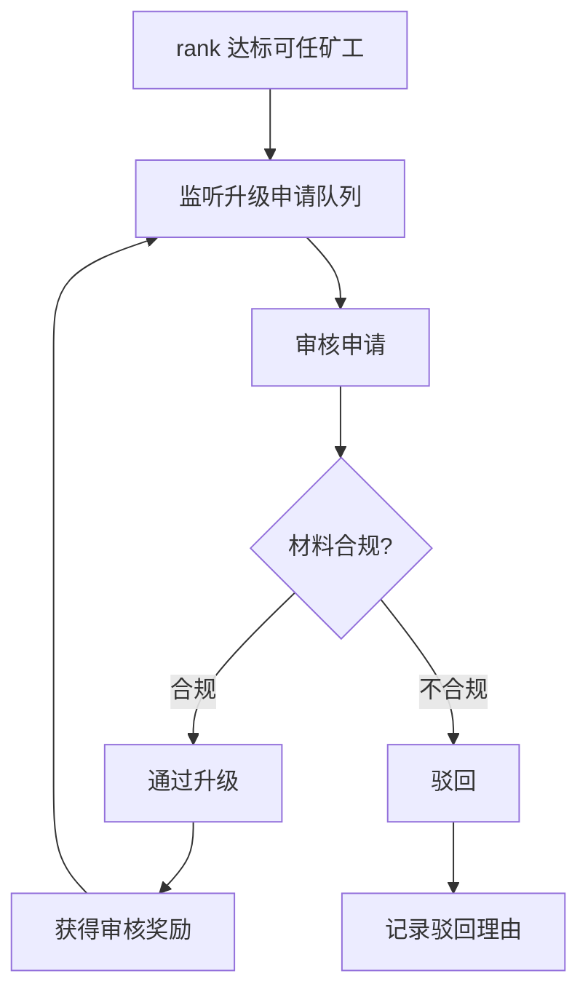

---

## 六、核心商业闭环(精简,仅资金流)

> v1.0 有三大流(资金/价值/关系),v2.0 只保留技术最必需的资金流时序,价值流与关系流已隐含在第四章耦合链路中。

### 6.1 资金流时序(用户付款后资金去向)

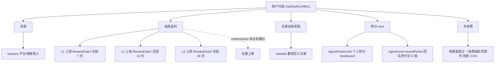

### 6.2 退款回滚(三重防护)

1. **前置硬条件**:退货前必须先 `returnReward` 退回奖励
2. **逐层 revoke**:AgentReward 沿链撤销未领取奖励
3. **自动抵扣**:已领取的从后续未领取佣金自动抵扣

**关键铁律**:退货只退钱,**不解除关系**(保护归因链路可信度)。

---

## 七、演进留白(只列预留点,不展开)

| 预留点 | 位置 | 为何预留 | 阶段 |
|---|---|---|---|
| SKU 规格层 | L3 ISkuRegistry | 代销体系需按 SKU 定价 | v1.x |
| 代销合约 | L3 新建 | 代销定价/上下架/库存映射 | v1.x |
| 提货方式扩展 | L3 | 支付代付/Swap 权益白名单 | v1.x |
| 租赁渠道 | L5 RentalChannel(ERC-4907) | 资产使用权流转 | v1.x |
| 水龙头社区任务 | L6 | 任务制领币 | v1.x |
| 关系转移/地址迁移 | L2 ReferralRegistry.proposeMigration | 多签治理 | v1.x |
| 应用中心抽成结算 | L7 | CPS 结算周期 | v1.x |
| 资产 token 化 | L3 ISkuRegistry 接口 | codeId→ERC-721/1155 | v2.0 |
| 荷兰拍渠道 | L5 新建 | 复用 lockSku+TradeLedger | v2.0 |
| 集邮挖矿 | L5 | 依赖 token 化 | v2.0 |
| 团队积分转移 | L4 AgentLevel | recordPoints 反向操作(不可用于升级) | v2.0 |
| 烧断保护 | L4 | 高级风控 | v2.0 |
| 保险库 L2/L3 | L6 Vault | 钥匙权重模型(1/2/3 票) | v2.0 |

> v2.0 细节(租赁/荷兰拍/集邮挖矿/保险库 L2/L3)在 v1.0 第十一章有展开,v2.0 不重述,需要时引用 v1.0。

---

## 八、待团队讨论事项(保留,PM 决策入口)

1. **代销体系货源模型**:从官方进货 vs 从上级转进(影响多级分销链路)
2. **代销分润机制**:代销零售是否触发级差返利(影响代理动力与平台收入)
3. **资产 token 化时机**:何时启动 codeId→ERC-721/1155 标准化(影响集邮挖矿排期)
4. **应用中心抽成费率**:CPS 比例/T+7/T+30 结算周期(影响合作方上架意愿)
5. **8 项财务参数**:rebateBps 矩阵数值/佣金比例/手续费率等(影响金额正确性)
6. **矿工门槛与奖励**:rank≥?可任矿工,审核奖励数额(影响升级审核效率)

---

## 九、下一步行动

| 行动 | 产出 | 负责人 |
|---|---|---|
| 评审本 v2.0 方案 | 团队共识 | PM+技术+运营 |
| Mermaid 图源校验(飞书渲染) | 渲染截图 | PM |
| Draw.io 旗舰大图 1-2 张 | 商业全景 SVG | PM |
| 代销体系原型设计 | 原型 HTML | PM |
| 合约改造影响评估 | 技术评估文档 | 技术 |
| 财务参数对齐 | 参数表 | PM+财务 |

---

**v2.0 设计结论**:Node 蓝图本质是"以设备指纹为信任根基、以链上永久关系为护城河、以级差返利为引擎"的模块耦合体。v2.0 聚焦 8 条核心耦合链路 + 9 类参与者的身份叠加,留白 v1.x/v2.0 演进。已定内容(护城河/竞品/铁律/飞轮)不重述,引用 v1.0 即可。
