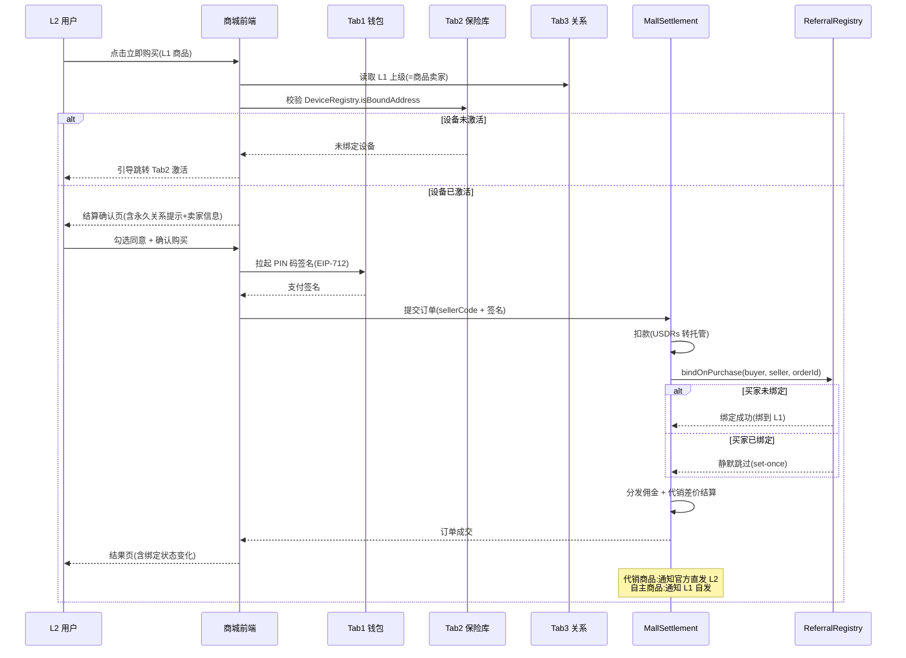

# Node 商城模块设计方案

> ⚠️ **DEPRECATED（已废弃）—— 2026-07-25 归档声明**
>
> 本文档（v2.0"层级化代理商城"）所描述的核心设计已被推翻，**不再作为有效设计依据**。请勿基于本文档进行开发或方案编写。
>
> **废弃原因**：v2.0 基于"分级代理商城 + 代销 + 层级商品池"模型，与现行合约基准、产品决策、原型实现三方共识根本冲突：
> - 现行设计为"**统一商品池 + 级差返利**"（所有用户共享同一商品池、同一价格）
> - v2.0 的"下级只看直推上级(L1)商品池"已被取消
> - v2.0 的"代销/囤货"双轨模式已被取消（商品详情页仅"立即购买"）
> - v2.0 的"官方不对 C 端，只对 L1 代理开放"已被取消（合约 `createProduct` 为 `onlyMiner`，仅官方上架）
>
> **现行有效文档**（请以下列文档为准）：
> - 产品文档：[Node产品文档-v1.0.md](../01-需求/Node产品文档-v1.0.md)（第 5 章交易/商城）
> - 业务方案：[商城业务逻辑调整方案（对齐交易&代理返利合约体系）.md](./商城业务逻辑调整方案（对齐交易&代理返利合约体系）.md)
> - 原型：[mall_v4_demo.html](../../原型/商城/mall_v4_demo.html)
> - 合约基准：[交易相关合约/](./交易相关合约/)
>
> **本文档保留目的**：仅作历史决策演进记录，便于团队回溯"为何从层级代理商城演变为统一商品池"。如需查阅，请始终对照上述现行文档。

---

> **文档定位**:Node 商城从 v1.0"成交型归因载体"升级为 v2.0"层级化代理商城",跟随 Aeon R9 分销团队层级,新增代理模式(代销/囤货),补齐层级分销电商闭环。
> **关联文档**:
> - [Aeon R9 冷钱包上下级永久绑定:合约设计与 App 后端实施](./Aeon%20R9冷钱包上下级永久绑定：合约设计与%20App%20后端实施.md)
> - [Aeon R9 集成 Node 产品架构演变方案](./Aeon%20R9集成Node产品架构演变方案.md)
> - [PRD-Node产品总纲](../01-需求/PRD-Node产品总纲.md)
> **版本**:v2.0 | **日期**:2026-07-16 | **状态**:DEPRECATED（2026-07-25 归档）

---

## 0. v2.0 变更说明

### 0.1 定位迁移

| 维度 | v1.0(2026-07-10) | v2.0(2026-07-16) |
|------|------------------|------------------|
| **核心定位** | 成交型归因载体(扁平商城) | 层级化代理商城(跟随分销团队) |
| **商品来源** | 全平台分销商+官方直营,扁平展示 | 严格层级:下级只看直推上级(L1)商品池 |
| **官方角色** | 官方直营店铺,对 C 端开放 | 纯层级:官方不对 C 端,只对 L1 代理开放 |
| **交易形态** | 仅单独购买(直购) | 直购 + 代理模式(代销/囤货) |
| **首页推荐** | 热门分销员(店铺卡) | 热门商品(上级商品池销量 TOP) |
| **商品详情** | 图文+卖家卡+特性+SKU+关系提示 | 精简:价格+名称+详情+商品图(≤3 张),关系提示移结算页 |
| **卖家中心** | 卖家中心(扁平店铺) | 代理中心(层级代理+三类订单+收货地址) |
| **归因闭环** | bindOnPurchase(保留) | bindOnPurchase(保留,仅直购触发;代理进货不触发) |

### 0.2 v2.0 决策汇总(14 项)

#### 架构核心(7 项)

| # | 决策点 | 结论 |
|---|--------|------|
| 1 | 商城可见范围 | **严格层级**:下级只看直推上级(L1)商品池 |
| 2 | 代理模式 | **双轨并行**:P1 先做代销(一件代发),P2 做囤货(自主经销) |
| 3 | 官方触达 | **纯层级**:官方不对 C 端,只对 L1 代理开放商品 |
| 4 | 代销发货 | **官方直发终端**:L1 代销官方商品,L2 下单后官方直发 L2 |
| 5 | 定价权 | **指导价区间**:官方设零售指导价区间,L1 在区间内自主定价 |
| 6 | 永久关系提示 | **移到结算页**:详情页纯商品信息,铁律提示在结算页明示 |
| 7 | 商品详情字段 | **价格+名称+详情+商品图**(1 主图+≤2 副图,共 ≤3 张) |

#### 次级规则(7 项)

| # | 决策点 | 结论 |
|---|--------|------|
| 8 | 代理申请门槛 | 任意已绑定下级 + 上级审核通过即可代销 |
| 9 | 代销代理价 | **等级统一代理价**:官方按 L1 等级定供货价,L1 赚"零售价-代理价"差价 |
| 10 | 缺货兜底 | 显示"缺货·可通知上级补货",L2 通知 L1,不穿透官方(保纯层级) |
| 11 | 批发定价(P2 囤货) | 阶梯数量 + 等级折扣结合(10/50/100 件,L1/L2 不同价) |
| 12 | 商品图规则 | 1 主图(封面)+ 最多 2 副图,共 ≤3 张 |
| 13 | 收货地址 | 区分"直购收货地址"与"代理进货地址"两套 |
| 14 | 卖家中心改名 | "卖家中心" → "代理中心"(贴合层级代理定位) |

### 0.3 不变的部分(v1.0 沿用)

- Aeon R9 三铁律:set-once / 退货不退关系 / 设备指纹校验
- `bindOnPurchase` 归因机制与授权白名单
- MallSettlement 合约核心逻辑(扣款→bindOnPurchase→佣金分发)
- 与 Tab 1(钱包)/Tab 2(设备校验)/Tab 3(关系与佣金)的集成关系
- 佣金分账比例(20/14/10 + 7/6 + 2,待财务确认)
- Tab 4 独立成 Tab,跟随全局钱包身份模型

---

## 1. 方案概述

### 1.1 背景

v1.0 商城定位为 Aeon R9 渠道四"购买即绑定"的落地载体,采用**扁平化设计**:全平台分销商商品统一展示,买家与卖家是"一次成交即绑定"的弱关联,商城不区分买家是谁的下级。

实际运营发现,该设计与 Node 的分销团队体系脱节:
- 分销团队是**层级化**的(官方→L1→L2→L3),但商城是**扁平**的,代理无法管控下级看到的商品
- 仅有"直购"一种交易形态,缺少"代理"模式(批发/代销),代理盈利空间单一
- "热门分销员"推荐位偏离商品本质,且与层级代理逻辑冲突

v2.0 将商城重构为**层级化代理商城**:商城跟随分销团队层级,下级看到的商城实际是上级代理的商品池;新增代理模式作为独立交易形态,参考主流分销电商(云集/贝店/微商体系)的代销与囤货双轨。

### 1.2 商业化价值

| 维度 | v1.0 价值 | v2.0 新增价值 |
|------|----------|--------------|
| 归因闭环 | 成交即 bindOnPurchase | 保留(仅直购触发) |
| 分销动力 | L1 佣金 | + 代理差价收益 + 层级商品池继承 |
| GMV 载体 | 直购 GMV | + 代理批发 GMV + 代销分成 GMV |
| 代理激励 | 仅佣金 | 代理可建商品池、定零售价、赚差价,能动性大幅提升 |
| 层级管控 | 无 | 上级管控下级可见商品,关系与商品池绑定 |

### 1.3 方案目标与范围

- **包含**:层级化商品池、代理体系(代销/囤货)、商品详情精简、代理中心、三类订单管理、收货地址、与 Aeon R9 归因的对齐、后端服务扩展、实施路径
- **不包含**:SKU 级运营策略、物流系统设计、法币支付通道(后续单独方案)、代理等级体系细则(P3)

---

## 2. 架构决策

### 2.1 核心定位(v2.0)

**商城 = 层级化代理商城**。商城跟随 Aeon R9 分销团队层级,下级打开商城看到的是直推上级(L1)的商品池。商品池由两部分构成:上级代理继承的官方商品(代销)+ 上级自主上架的商品。商城同时承载两种交易形态:直购(成交归因)与代理(批发/代销,不触发归因)。

### 2.2 架构链路图

```
官方(总仓商品)  ──[只对 L1 开放,不对 C 端]──┐
   │                                          │
   │  L1 申请代销官方商品                      │
   │  官方设:① 指导价区间(零售) ② 等级代理价(供货)
   ▼                                          │
L1 代理商品池 = 代销继承的官方商品 + L1 自主上架商品
   │  L1 在指导价区间内自主定零售价             │
   │                                          │
   ▼  [严格层级:下级只看 L1 商品池]            │
L2 用户打开商城 → 看到 L1 商品池
   │                                          │
   ├─ 直购 L1 商品 ──→ 成交触发 bindOnPurchase 绑 L1
   │   ├ 代销商品:官方直发 L2(一件代发)
   │   └ 自主商品:L1 自发 L2
   │   └ 永久关系提示在结算页(详情页纯商品信息)
   │                                          │
   └─ 申请代理 L1 商品(P1 代销 / P2 囤货)
       ├ P1 代销:L2 不收货,下下级买时官方/L1 直发
       └ P2 囤货:L2 批发进货到自库,自主定价自发
```

### 2.3 归因规则对齐

| 交易形态 | 触发 bindOnPurchase? | 关系处理 | 佣金流向 |
|---------|---------------------|---------|---------|
| 直购(下级买上级商品) | ✅ 触发 | 未绑定→绑卖家;已绑定→静默跳过 | 按既有 L1/L2/L3 链发 |
| 代理-代销(不收货) | ❌ 不触发 | 代理已是下级,关系已存在 | 无关系变更,仅代理差价结算 |
| 代理-囤货(批发进货) | ❌ 不触发 | 同上 | 无关系变更,仅批发扣款 |

**关键**:代理进货是"已有下级向已上级补货",不产生新关系;直购是"成交型获客",触发归因。两者解耦,合约层 bindOnPurchase 逻辑无需改动。

---

## 3. 商城在 Node 框架中的定位

### 3.1 5 Tab 结构(Tab 4 不变)

```
┌──────────────────────────────────────────────────┐
│  Tab 1: 冷钱包 (资产操作)                         │
│  Tab 2: 身份 (Web3身份的权益与凭证)                │
│  Tab 3: 团队 (Aeon R9 关系网络)                   │
│  Tab 4: 商城 (层级化代理商城)  ★v2.0 升级          │
│   商品浏览 / 直购下单 / 代理中心 / 订单管理         │
│  Tab 5: 应用市场 (连接型,无归因)  ★规划            │
└──────────────────────────────────────────────────┘
```

### 3.2 与各 Tab 的关系(v2.0 微调)

```
Tab 1 冷钱包 → 提供全局钱包(购买身份/付款地址)
Tab 2 保险库 → 设备指纹校验(加入团队时已上链绑定,直购+代理申请时读取校验状态,反女巫)
Tab 3 团队   → 关系层级决定商品池来源(L1=直推上级)
              → 佣金明细新增"代理差价收益"来源
Tab 4 商城   → 直购成交触发 bindOnPurchase;代理进货不触发
```

**与 Tab 3 的关键关联**:商城的"严格层级"依赖 Tab 3 的 `referrerOf`——用户的 L1 上级即其商城商品池来源。Tab 3 关系写入后,商城自动刷新商品池为上级商品。

### 3.3 身份模型(沿用 v1.0)

商城不自建身份切换器,购买身份 = Tab 1 全局钱包,关系身份 = 购买地址(链上自动)。代理身份 = 已绑定下级地址,无需额外切换。

---

## 4. 核心功能设计

### 4.1 层级化商品池(v2.0 新增)

#### 4.1.1 商品池构成

```
L1 代理商品池
├ 代销继承商品(来自官方总仓,L1 申请代销后加入)
│   ├ 官方设指导价区间 + 等级代理价
│   └ L1 在区间内定零售价,加入商品池
└ 自主上架商品(L1 自己创建,经 B 端审核)
    └ L1 自主定价(参考市场价)

L2 用户打开商城 → 只看到 L1 商品池(严格层级)
L3 用户打开商城 → 只看到 L2 商品池(L2 的代销+自主)
```

#### 4.1.2 严格层级规则

| 规则 | 说明 |
|------|------|
| 可见范围 | 用户商城只展示其 L1 上级的商品池,不看全平台 |
| 无上级 | 未绑定用户商城为空,引导先绑定(扫码/邀请/首购) |
| 缺货兜底 | 商品显示"缺货·可通知上级补货",L2 点击通知 L1,**不穿透官方**(保纯层级) |
| 官方不可见 | 官方商品不直接对 C 端,只通过 L1 代销继承触达 |

#### 4.1.3 商品类型(沿用 v1.0)

| 商品类型 | 说明 | 归因参与 | 履约方式 |
|---------|------|---------|---------|
| 实物商品 | 硬件设备、周边 | 直购时 bindOnPurchase | 物流发货(代销官方直发/自主代理自发) |
| 虚拟商品 | 数字权益、兑换码、会员卡 | 直购时 bindOnPurchase | 链上/系统发放 |
| 服务包 | 福利方案、增值服务、咨询 | 直购时 bindOnPurchase | 服务激活 |

### 4.2 代理体系(v2.0 重写,替代 v1.0"分销商体系")

#### 4.2.1 代理身份与准入

```
代理(seller)
├ 身份:已绑定的钱包地址(必须有短号,有 L1 上级)
├ 准入:任意已绑定下级均可申请 + 上级审核通过
├ 商品池:代销继承(官方/上级商品)+ 自主上架
└ 收益:直购佣金(L1)+ 代理差价(代销/囤货)
```

| 准入条件 | 说明 |
|---------|------|
| 已绑定 | 必须是已绑定上级的地址(有短号,在 Tab 3 已加入团队) |
| 上级审核 | 向上级提交代理申请,上级审核通过后可代销其商品池 |
| 设备校验 | 申请代理前强制 DeviceRegistry.isBoundAddress 校验(反女巫) |

#### 4.2.2 代理等级与供货价(等级统一代理价)

| 代理等级 | 准入 | 供货价(官方给代理) | 定价权 |
|---------|------|-------------------|--------|
| L1 代理 | 已绑定 + 上级审核 | 官方按 L1 等级定(如零售价 70%) | 指导价区间内自主定价 |
| L2 代理 | L1 审核通过 | 按 L2 等级定(如零售价 75%) | 同上 |
| L3 代理 | L2 审核通过 | 按 L3 等级定(如零售价 80%) | 同上 |

> 等级越高(层级越靠上),供货价越低,代理利润空间越大,激励向上发展团队。

### 4.3 代理模式:代销与囤货(v2.0 新增)

#### 4.3.1 双轨对比

| 维度 | 代销(批量代销·一件代发) | 囤货(自主经销) |
|------|---------------|---------------|
| **优先级** | P1(先做) | P2(后做) |
| **库存** | 虚拟库存(批量申请,不收货) | 实物库存(批发进货) |
| **发货方** | 官方/上级直发终端 | 代理自发 |
| **定价权** | 指导价区间内 | 完全自主 |
| **资金风险** | 低(赚差价) | 高(赚批发-零售差) |
| **资金占用** | 无(按成交结算) | 有(先付款进货) |
| **补货机制** | 库存低于阈值提醒补货 | 自主补货 |
| **适合人群** | 新手代理、轻资产 | 成熟代理、重资产 |

#### 4.3.2 代销模式(P1)流程(v2.2 重写:批量代销+库存管理)

##### 4.3.2.1 核心机制变更说明

> v2.0 原代销为"单件代销、无库存、按成交结算",v2.2 调整为"**按库存数量批量代销**":下级按上级设定的代销方案批量申请代销库存,库存进入下级商品池,下级定价后在指导价区间内销售给其下级,官方一件代发终端。代销不再是"无库存",而是"**虚拟库存管理**(代理不收货,但管理代销库存数量)"。

##### 4.3.2.2 代销批量方案(上级设定)

上级(L1)为每个可代销商品设定**代销方案规则**,下级(L2)在方案规则内选择数量申请代销:

| 方案字段 | 说明 | 示例 |
|---------|------|------|
| **起代量(minQty)** | 单次代销最低数量 | 10 件起 |
| **单次上限(maxQty)** | 单次代销最高数量 | 200 件 |
| **梯度供货价(tiers)** | 按数量梯度的供货价,数量越多单价越低 | 10件139U / 50件129U / 100件119U |
| **补货阈值(restockThreshold)** | 剩余库存低于此值时触发补货提醒 | 剩余 5 件时提醒 |

**梯度供货价示例**(L2 硬件钥匙芯片,零售价 199U):
| 梯度 | 供货价(给 L1) | 单件差价(L2 赚) |
|------|--------------|---------------|
| 10-49 件 | 139 U | 60 U/件 |
| 50-99 件 | 129 U | 70 U/件 |
| 100 件以上 | 119 U | 80 U/件 |

##### 4.3.2.3 代销申请流程(详情页入口)

```
L2 在商城浏览 L1 商品池 → 点击商品进入详情页
  → 详情页底部"申请代销"按钮(代销商品才显示)
  → 弹出代销批量申请弹窗,展示:
    ├ L1 设定的代销方案(起代量/上限/补货阈值)
    ├ 梯度供货价表(当前数量对应梯度高亮)
    ├ 数量选择器(加减按钮+输入+快速选择梯度量)
    └ 实时费用明细(总供货款/总销售额/总差价)
  → L2 选择数量并确认申请 → 提交 L1 审核
  → L1 审核通过 → 代销库存进入 L2 商品池(虚拟库存)
  → L2 在指导价区间内定零售价 → 商品对 L3 可见
```

##### 4.3.2.4 代销库存管理与销售

```
L2 代销库存进入商品池后:
  ├ 库存管理:代理中心查看剩余库存/已售/已赚差价
  ├ 库存进度条:剩余/总量,低于补货阈值时标红"需补货"
  ├ 补货:再次进入详情页申请代销(追加库存)
  ├ 改价:在指导价区间内调整零售价
  └ 下架:停止销售(剩余库存退回 L1)
  
L3 直购 L2 代销商品:
  → 成交触发 bindOnPurchase(L3 绑 L2)
  → 官方直发 L3(一件代发,L2 不收货)
  → L2 赚"零售价-梯度供货价"差价
  → L2 代销库存 -1,已售 +1
  → 库存低于阈值时通知 L2 补货
```

##### 4.3.2.5 代销收益结算

- **L2 差价** = L3 实付零售价 − L2 申请代销时的梯度供货价
- 梯度供货价在申请代销时锁定(不随后续 L1 调价变动)
- 差价在成交时由 MallSettlement 自动结算给 L2
- L2 同时作为 L3 的 L1 上级,获得佣金(若关系如此)

##### 4.3.2.6 代销方案设定入口(L1 视角)

L1 代理可在代理中心为每个可代销商品设定/调整代销方案:
- 起代量/单次上限/补货阈值
- 梯度供货价(最多 3 档)
- 方案变更后对新申请生效,已代销库存按原供货价锁定

#### 4.3.3 囤货模式(P2)流程

```
L1 批发进货 → 按阶梯数量 + 等级折扣付批发价 → 商品入 L1 库存
  → L1 自主定价上架 → 商品进入 L1 商品池
  → L2 直购 → L1 自发 L2 → 成交触发 bindOnPurchase
  → L1 赚"零售价-批发价"差价(已在进货时锁定)
```

**批发定价规则**(阶梯 + 等级):
| 拿货量 | L1 批发价 | L2 批发价 | L3 批发价 |
|--------|----------|----------|----------|
| 10 件起 | 零售价 65% | 70% | 75% |
| 50 件起 | 55% | 60% | 65% |
| 100 件起 | 45% | 50% | 55% |

### 4.4 商品浏览与详情(v2.0 精简)

#### 4.4.1 首页结构(改动)

```
Tab 4: 商城首页
┌─────────────────────────────────────────┐
│  当前钱包:0xAAA...98A5 (只读)            │
│  绑定状态:已绑定到 #100023(L1=代理张三)   │
│  我的商品池来源:#100023 张三的店铺         │
├─────────────────────────────────────────┤
│  分类:全部 / 实物 / 虚拟 / 服务包         │
│  筛选:销量 / 价格 / 代销 / 自主          │
├─────────────────────────────────────────┤
│  🔥 热门商品(上级商品池销量 TOP,横向滚动) │
│  ┌──────┐ ┌──────┐ ┌──────┐            │
│  │ 商品A │ │ 商品B │ │ 商品C │            │
│  └──────┘ └──────┘ └──────┘            │
├─────────────────────────────────────────┤
│  ✨ 为你推荐(双列瀑布流,来自 L1 商品池)   │
│  商品卡片:图 + 名称 + 价格 + 代销/自主标  │
└─────────────────────────────────────────┘
```

**v2.0 改动**:
- "热门分销员"推荐位 → **"热门商品"推荐位**(商品图+名称+价格,来自 L1 商品池)
- 商品卡片去掉卖家卡(下级已知卖家=自己上级),保留"代销/自主"来源标
- 顶部新增"商品池来源"明示(我的 L1 是谁)

#### 4.4.2 商品详情页(精简至 4 字段)

```
商品详情页
├ 商品图(1 主图 + ≤2 副图,共 ≤3 张,可滑动)
├ 价格(USDRs,大字)
├ 名称
├ 详情(文字描述)
└ [立即购买]  ← 点击进入结算页(关系提示在此)
```

**精简对照**:

| 保留 | 去掉 |
|------|------|
| ✅ 价格 | ❌ 卖家信息卡(短号/地址/销量/评分) |
| ✅ 名称 | ❌ 特性标签列表 |
| ✅ 详情(文字) | ❌ SKU 编号 |
| ✅ 商品图(≤3 张) | ❌ 库存/好评率展示 |
|  | ❌ 永久关系提示(移到结算页) |

> 卖家信息与永久关系提示移至结算页,既满足详情精简,又遵循 Aeon R9"知情确认"铁律。

### 4.5 下单与结算流程(v2.0 分离直购/代理)

#### 4.5.1 直购流程(成交归因)



**结算页必须明示**(铁律):
- "购买后将与卖家 #XXXXX(你的 L1 上级)建立**永久**上下级关系"
- "此关系一旦建立终身不可更改"
- 卖家信息:短号/地址(从详情页移至此处)
- 代销商品标注"由官方直发",自主商品标注"由卖家自发"
- 用户勾选同意后才可提交订单

#### 4.5.2 代理进货流程(不触发归因)

```
L1 代理中心 → 选择代理商品(官方/上级商品池)
  → 选择代理模式:代销(P1)/ 囤货批发(P2)
  → [代销] 申请代销 → 上级审核 → 加入我的商品池(无付款)
  → [囤货] 选择批发数量 → 按阶梯+等级算批发价 → PIN 签名付款
  → 商品入我的库存(囤货)或我的商品池(代销)
  → ❌ 不调用 bindOnPurchase(已是下级)
  → ❌ 无关系变更,无佣金分账(仅批发扣款/代销记账)
```

### 4.6 代理中心(v2.0 重写,替代 v1.0"卖家中心")

```
代理中心(从商城顶部入口或 Tab3 推广中心进入)
├ 店铺概览卡
│   ├ 代理身份:短号/地址/代理等级(L1/L2/L3)
│   ├ 商品池来源:我的 L1 上级
│   └ 核心数据:累计销量/下线人数/本月收益(佣金+差价)
├ 快捷功能
│   ├ 申请代理(浏览上级商品池,申请代销)
│   ├ 上架商品(自主上架,经 B 端审核)
│   ├ 商品管理
│   ├ 订单管理
│   └ 数据看板
├ 商品管理
│   ├ 代销商品(继承自官方/上级,显示供货价+我的零售价)
│   ├ 自主上架商品(我创建的,显示库存+销量)
│   └ 状态:上架中/审核中/已下架
├ 订单管理(三类)
│   ├ 直购订单(我作为买家,买上级商品)  ← C 端视角
│   ├ 代理进货订单(我作为代理,批发/代销进货)  ← B 端视角
│   └ 代理销售订单(下级买我的商品)  ← B 端视角
├ 收货地址管理
│   ├ 直购收货地址(实物直购用)
│   └ 代理进货地址(囤货批发用,可多仓库)
└ 数据看板
    ├ GMV(直购+代理销售)
    ├ 代理差价收益
    ├ 佣金收益(L1/L2/L3)
    └ 新增下线(来自直购归因)
```

### 4.7 订单管理(v2.0 三类订单)

#### 4.7.1 订单分类

| 订单类型 | 视角 | 触发归因 | 包含内容 |
|---------|------|---------|---------|
| 直购订单 | C 端(我买上级) | ✅ | 商品/卖家(=L1)/金额/绑定状态/物流 |
| 代理进货订单 | B 端(我进货) | ❌ | 商品/上级/批发量/批发价/收货地址 |
| 代理销售订单 | B 端(下级买我) | ✅(下级触发) | 商品/买家(=下级)/金额/绑定状态/发货 |

#### 4.7.2 订单状态机

```
直购/代理销售订单:
  待付款 → 待发货 → 待收货 → 已完成
              ↓         ↓
           已退款    已退款(退货不退关系)

代理进货订单(囤货):
  待付款 → 待发货(上级发我) → 待收货 → 已入库

代理代销申请:
  待审核 → 已通过(加入商品池) / 已拒绝
```

### 4.8 售后与退款(沿用 v1.0 铁律)

**铁律:退货只退钱,不退关系。**

| 场景 | 资金处理 | 关系处理 |
|------|---------|---------|
| 直购退款 | 退还买家 USDRs + 冲减佣金 + 冲减代销差价 | **不变**(referrerOf 永久) |
| 代理进货退款 | 退还代理批发款(未发货时) | 无关系影响 |
| 代销商品退货 | 退还买家,冲减 L1 差价 + 佣金 | **不变** |

---

## 5. 与现有模块的集成关系

### 5.1 与 Tab 1 冷钱包(支付)

| 集成点 | v2.0 说明 |
|--------|----------|
| 全局钱包读取 | 商城顶部展示 Tab1 当前钱包(只读) |
| 支付签名 | 直购 + 囤货批发均复用 EIP-712 + PIN 码 |
| 余额校验 | 直购/批发前检查 USDRs 余额 |

### 5.2 与 Tab 2 保险库(设备校验)

直购下单前 + 代理申请前,均强制 `DeviceRegistry.isBoundAddress` 校验,反女巫。

### 5.3 与 Tab 3 团队(归因与佣金)

| 集成点 | v2.0 说明 |
|--------|----------|
| 商品池来源 | Tab3 `referrerOf` 决定商城展示谁的商品池(L1) |
| 绑定状态同步 | 直购 bindOnPurchase 成功 → Tab3 推广中心刷新 |
| 佣金明细 | 新增"代理差价收益"来源,与 L1/L2/L3 佣金并列展示 |
| 代理申请 | 代理申请记录可在 Tab3 关系树中查看(谁代理了谁) |

### 5.4 与 B 端服务管理后台

B 端后台「商城管理」模块扩展:

```
服务管理后台
  └ (新增)商城管理
      ├ 官方总仓商品管理(对 L1 开放的代销商品池)
      ├ 代理审核(代理申请审核/封禁)
      ├ 商品审核(自主上架审核/下架)
      ├ 指导价与代理价配置(按等级设供货价/区间)
      ├ 订单监控(异常订单/退款审核)
      ├ GMV 看板(直购/代理/批发分类看板)
      └ 孤儿单认领(无上级直购的分配)
```

---

## 6. 后端服务新增清单

| 服务 | 职责 | v1.0/v2.0 | 优先级 |
|------|------|-----------|--------|
| 商城商品服务 | 商品 CRUD、上下架、**层级商品池过滤** | v2.0 扩展(层级过滤) | P1 |
| 代理服务 | 代理申请/审核、代理关系、等级管理 | v2.0 新增 | P1 |
| 代销服务 | 代销继承、差价结算、官方直发调度 | v2.0 新增 | P1 |
| 库存服务 | 囤货库存管理、阶梯批发价计算 | v2.0 新增 | P2 |
| 店铺服务 | 代理店铺注册、关联 sellerCode | v1.0 沿用 | P1 |
| 订单服务 | 订单创建、**三类订单状态机**、物流对接 | v2.0 扩展(三类) | P1 |
| 结算合约(链上) | 扣款、托管、bindOnPurchase、佣金+差价分发 | v1.0 沿用+扩展 | P1 |
| 收货地址服务 | 直购地址/代理进货地址两套管理 | v2.0 新增 | P1 |
| 孤儿单分配服务 | 无上级直购认领 | v1.0 沿用 | P2 |
| 营销服务 | 优惠券、秒杀、满减 | v1.0 沿用 | P3 |

**架构原则说明**:商品/订单/代理服务管的是交易元数据,不涉及用户私钥/凭证,与 Node"云端无状态"原则不冲突。

---

## 7. 链上合约层

### 7.1 合约清单

| 合约 | 职责 | v2.0 状态 |
|------|------|----------|
| ReferralRegistry(已有) | 永久上下级关系,含 bindOnPurchase | 不动 |
| MallSettlement(扩展) | 结算合约:扣款+bindOnPurchase+佣金+**代销差价**分发 | 扩展差价结算 |

### 7.2 MallSettlement 扩展点

v1.0 核心逻辑(扣款→bindOnPurchase→佣金分发)保留,新增:

```solidity
contract MallSettlement {
    // v1.0 沿用
    ReferralRegistry public immutable referral;
    IERC20 public immutable usdrs;
    // v2.0 新增:代销差价结算
    mapping(address => uint256) public agentSupplyPrice; // 代理等级→供货价(bps)
    
    // v2.0 新增:直购结算(含代销差价)
    function checkoutWithAgency(
        uint256 orderId,
        address buyer,
        address seller,
        uint256 retailPrice,   // L1 定的零售价
        uint256 supplyPrice,   // 官方给 L1 的供货价
        bool isAgencyProduct,  // 是否代销商品
        bytes calldata buyerSig
    ) external {
        // 1. 验签 + 扣款(retailPrice)
        // 2. bindOnPurchase(仅直购触发,代理进货走另一方法)
        referral.bindOnPurchase(buyer, seller, orderId);
        // 3. 佣金分发(L1/L2/L3)
        _distributeCommission(buyer, retailPrice);
        // 4. v2.0 新增:代销差价结算给 L1
        if (isAgencyProduct) {
            uint256 agencySpread = retailPrice - supplyPrice;
            usdrs.transfer(seller, agencySpread);
            // 剩余 supplyPrice 打给官方总仓
            usdrs.transfer(treasury, supplyPrice);
        } else {
            // 自主商品:全款打给卖家
            usdrs.transfer(seller, retailPrice);
        }
    }
    
    // v2.0 新增:囤货批发(不触发 bindOnPurchase)
    function wholesale(
        uint256 orderId,
        address agent,
        address supplier,
        uint256 quantity,
        uint256 wholesalePrice,
        bytes calldata agentSig
    ) external {
        // 1. 验签 + 扣款(wholesalePrice * quantity)
        // 2. ❌ 不调用 bindOnPurchase(已是下级)
        // 3. 货款打给 supplier(官方/上级)
        // 4. 库存服务记录 agent 入库
    }
}
```

### 7.3 审计重点关注(v2.0 新增)

| 风险点 | 严重度 | 缓解措施 |
|--------|--------|----------|
| 代销差价结算精度 | 中 | bps 基点,余数归官方 |
| 代销库存超卖(多代理共享官方库存) | 高 | 官方总仓锁库存,成交原子扣减 |
| 囤货批发重放 | 高 | orderId + nonce |
| 代理等级与佣金层级耦合 | 中 | 代理是交易角色,L1/L2/L3 是关系角色,合约层解耦 |

---

## 8. 商业化延伸设计

### 8.1 直播/私域下单场景(沿用 v1.0)

商城支持生成带 sellerCode 的商品分享链接,用于直播间挂商品、私域社群分享、Deep Link 唤起。商品分享链接是"成交型 Deep Link",归因优先级高于普通邀请链接。

### 8.2 代理等级与激励(P3 延伸)

| 等级 | 准入条件 | 权益 |
|------|---------|------|
| 普通代理 | 已绑定 + 上级审核 | 基础供货价 + L1 佣金 |
| 银牌代理 | 累计 GMV > X | 供货价折扣 + 首页推荐位 |
| 金牌代理 | 累计 GMV > Y + 团队规模 > Z | 更低供货价 + 专属运营 |

### 8.3 营销工具(沿用 v1.0,P3)

优惠券、秒杀、满减、拼团(需评估归因)。

### 8.4 硬件市场整合(沿用 v1.0)

硬件设备(L2/L3 钥匙芯片)作为商城实物商品,通过代理链销售,既产生 GMV 又完成归因 + 推动保险库钥匙升级。

---

## 9. 实施路径与优先级

### 9.1 P1(最小闭环:层级直购 + 代销)

**目标**:L2 用户能在商城买 L1 商品池的商品(含代销),成交绑定到 L1,代销差价自动结算。

| 任务 | 依赖 | 产出 |
|------|------|------|
| MallSettlement 扩展(代销差价结算) | ReferralRegistry 部署 | 链上结算基石 |
| 层级商品池服务(按 referrerOf 过滤) | Tab3 关系服务 | 层级化商品展示 |
| 代理服务(申请/审核/等级) | 后端框架 | 代理准入能力 |
| 代销服务(继承/差价/直发调度) | 代理服务 + 官方总仓 | 代销闭环 |
| Tab4 商城 v2.0(首页/详情精简/代理中心) | 后端服务 | 用户可见入口 |
| 收货地址服务(直购地址) | 订单服务 | 实物履约 |
| 设备校验集成(复用 Tab2) | 保险库 L1 | 反女巫 |
| bindOnPurchase 联调 | ReferralRegistry + MallSettlement | 归因闭环 |
| B 端商城管理(总仓/代理审核/指导价) | B 端后台 | 运营能力 |

### 9.2 P2(囤货闭环)

| 任务 | 依赖 | 产出 |
|------|------|------|
| 库存服务(囤货管理) | P1 完成 | 批发进货能力 |
| 阶梯批发价配置 | 库存服务 | 批发定价 |
| 囤货批发流程(wholesale 合约方法) | MallSettlement 扩展 | 批发结算 |
| 代理进货订单管理 | 订单服务 | 进货履约 |
| 代理进货地址管理 | 收货地址服务 | 囤货收货 |

### 9.3 P3(体验增强)

| 任务 | 依赖 | 产出 |
|------|------|------|
| 营销工具(优惠券/秒杀) | P2 完成 | 转化率提升 |
| 代理等级体系 | GMV 数据 | 代理激励 |
| 直播/私域分享链接 | Deep Link 能力 | 裂变获客 |
| 物流跟踪(实物) | 物流 API 对接 | 实物体验 |

---

## 10. 风险与待确认决策点

### 10.1 待与现有规则对齐

| # | 决策点 | 当前状态 | 需对齐方 |
|---|--------|----------|----------|
| 1 | 佣金分账比例(20/14/10+7/6+2)是否与 Aeon R9 一致 | 未确认 | 业务/财务 |
| 2 | 平台手续费率(feeRate)取值 | 未确认 | 财务 |
| 3 | 等级代理价具体折扣(L1=70%/L2=75%/L3=80%) | 未确认 | 财务/业务 |
| 4 | 指导价区间宽度(如零售价±10%) | 未确认 | 业务 |
| 5 | 退款时代销差价追回机制 | 未确认 | 财务/法务 |
| 6 | 代理等级体系细则(P3) | 未确认 | 业务 |
| 7 | 法币支付通道是否引入(当前仅 USDRs) | 未确认 | 财务/合规 |
| 8 | 实物商品代理进货是否需 KYC | 未确认 | 合规 |

### 10.2 技术风险

| 风险 | 严重度 | 缓解措施 |
|------|--------|----------|
| MallSettlement 合约漏洞(资金安全) | 高 | 严格审计 + 时间锁 + 灰度上线 |
| 代销库存超卖(多代理共享官方总仓) | 高 | 官方总仓锁库存,成交原子扣减 |
| 代理等级与佣金层级耦合 | 中 | 合约层解耦:代理=交易角色,L1/L2/L3=关系角色 |
| 层级商品池查询性能(referrerOf 过滤) | 中 | Indexer 预计算 + 缓存 |
| 实物商品履约纠纷 | 中 | 平台仲裁 + 代理保证金 |
| 高并发下单(秒杀场景) | 中 | 链下排队 + 链上结算异步 |

### 10.3 合规风险

| 风险 | 说明 | 缓解措施 |
|------|------|---------|
| 永久关系绑定纠纷 | 用户以"不知情"为由要求解绑 | 结算页强制勾选 + 链上签名凭证留存 |
| 多级分销合规 | 代理+L1/L2/L3 佣金叠加 | 严格控制在 L3,佣金 100% 挂钩实际流水,无预付 |
| 代销模式合规 | 代销涉及资金归集 | 差价由合约原子结算,不经代理手,避免二清 |
| 实物商品合规 | 硬件销售资质 | 确认资质 + 官方直发优先 |
| 税务 | GMV 税务申报 | 财务对接,本方案不展开 |

---

## 11. 总结

### 11.1 核心判断

v2.0 商城从"扁平成交归因载体"升级为"层级化代理商城",跟随 Aeon R9 分销团队层级。商城不再是全平台商品池,而是**下级看上级商品池**的层级化结构;交易形态从单一"直购"扩展为"直购 + 代理(代销/囤货)"双轨。

### 11.2 v2.0 三大设计动作

1. **层级化商品池**:严格层级,下级只看 L1 商品池;官方不对 C 端,只对 L1 代理开放
2. **代理模式双轨**:P1 代销(官方直发,赚差价)+ P2 囤货(阶梯批发,自主经销)
3. **详情精简 + 代理中心**:商品详情精简至 4 字段(价格/名称/详情/图≤3),卖家中心升级为代理中心(三类订单+收货地址+差价收益)

### 11.3 不变的核心

- Aeon R9 三铁律全部遵循(set-once / 退货不退关系 / 设备校验)
- bindOnPurchase 归因机制保留(仅直购触发,代理进货不触发)
- MallSettlement 合约核心逻辑保留,仅扩展代销差价与批发方法
- 与 Tab 1/2/3 的集成关系不变,Tab3 关系决定商品池来源

### 11.4 落地路径

P1 跑通"层级商品池 + 代理服务 + 代销闭环 + Tab4 v2.0 + 设备校验 + bindOnPurchase 联调",验证 L2 能买 L1 商品池(含代销)并自动绑定 + 差价结算;P2 叠加囤货批发;P3 叠加营销与代理等级。

---

## 附录 A:商城与 Aeon R9 5 渠道归因的关系(沿用 v1.0)

| 渠道 | 信号来源 | 商城的关系 | 归因优先级 |
|------|----------|-----------|-----------|
| 扫码绑定 | 上级二维码 | 无关(在 Tab3) | 2 |
| 邀请链接/Deep Link | refCode | 商品分享链接是成交型 Deep Link | 3(成交后升 1) |
| 主动邀请 | 邀请模块 | 无关(在 Tab3) | - |
| **购买即绑定** | sellerCode | **商城直购是唯一落地载体** | 1(最强) |
| 兜底孤儿 | 无 | 官方直营无卖家时进孤儿池 | 4 |

> v2.0 说明:代理进货**不触发**任何渠道归因,因代理已是下级,关系已存在。

## 附录 B:v2.0 交易形态与合约映射

| 商城动作 | 合约方法 | 触发归因 | 说明 |
|---------|----------|---------|------|
| 直购成交 | `MallSettlement.checkoutWithAgency` | ✅ | 含代销差价结算 |
| 关系绑定 | `ReferralRegistry.bindOnPurchase` | ✅ | checkout 内原子调用 |
| 佣金分账 | `MallSettlement._distributeCommission` | - | bindOnPurchase 后 |
| 代销差价结算 | `MallSettlement.checkoutWithAgency` 内 | - | retailPrice - supplyPrice 给 L1 |
| 囤货批发 | `MallSettlement.wholesale` | ❌ | 仅扣款+入库,不调 bindOnPurchase |
| 退款 | `MallSettlement.refund` | - | 退钱+冲减佣金+冲减差价,关系不变 |

## 附录 C:与 v1.0 的对齐说明

v2.0 严格遵循 v1.0 及 Aeon R9 原方案的以下铁律:
1. **Set-once**:bindOnPurchase 对已绑定买家静默跳过,不覆盖关系
2. **退货不退关系**:退款只退钱 + 冲减佣金/差价,referrerOf 永久不变
3. **设备指纹校验**:设备指纹在加入团队(Tab3)时已上链绑定,直购 + 代理申请时读取校验状态(DeviceRegistry.isBoundAddress),反女巫
4. **知情确认**:结算页强制明示永久关系(从详情页移至结算页,详情页精简)
5. **授权调用者白名单**:仅 MallSettlement 合约可调用 bindOnPurchase
6. **代理进货不归因**:代理是已有下级补货,不产生新关系,与归因解耦
