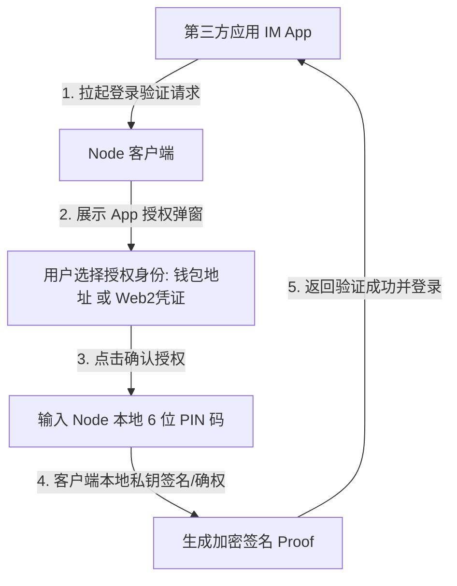

# Node 独立自管钱包与数字通行证设计方案

## 1. 方案背景与产品定位

### 1.1 行业背景与产品拆分初衷
为了提供更聚焦、更纯粹的 Web3 基础设施服务，我们将原有的“身份与 IM 聊天一体化”架构进行深度剥离，推出全新的独立产品 —— **Node (完全 Web3 态的自管钱包与数字通行证管理中枢)**。
* **业务解耦**：将社交聊天 (IM) 模块以及平台托管钱包资产（Web2 余额、账单明细等）从 Node 中完全移出，Node 仅作为自管钱包及 DID (去中心化身份) 通行证的本地安全钥匙箱。
* **独立生态定位**：Node 作为一个纯粹的 Web3 自管钱包和数字身份管理工具，对外输出标准化的“签名与登录验证接口”。其他的独立应用（包括拆分出去的 IM 聊天 App、DApp 浏览器、行业合作应用等）均通过“连接 Node”的方式，调用 Node 内部管理的冷钱包地址或本地 Web2 账号凭证进行去中心化签名登录。

### 1.2 核心产品设计原则
1. **纯 Web3 Native 架构**：产品引导仅提供 Web3 自管钱包创建与导入，不设传统 Web2 注册/登录入口，不设云端托管个人中心。
2. **本地凭证存储，云端无状态**：Node 的“数字身份通行证”允许管理传统 Web2 身份（手机号/邮箱/系统账号）。但这些凭证**仅保存在本地客户端的加密 Keychain 中**，云端和数据库绝不存储任何“钱包地址与 Web2 账号”的映射关系，彻底保障去中心化隐私。
3. **数字身份连接器 (DID Provider)**：作为外部应用的“登录钥匙”，当第三方 App 请求登录时，拉起 Node 的授权面板，用户选择任意身份并输入本地 PIN 码签名后，即可顺畅验证登录。

---

## 2. 产品功能模块与用户界面设计

Node 的用户界面由两个一级功能 Tab 构成（通过黑色悬浮胶囊底栏进行切换）：

### 2.1 钱包舱 (Wallet Panel)
* **资产看板**：展示当前活跃钱包的多链资产总估值、测试代币明细。
* **收发控制**：发送/接收资产的交互快捷区。
* **资产持仓明细**：分币种展示 RC Token (Gas 代币) 和 USDR Stable (结算代币) 的余额。

### 2.2 服务舱 (Service Hub)
* **特权福利**：参与链上测试币领取、空投福利。
* **安全与保障**：
  * **Goose 保险库 (Vault)**：展示与设备硬件绑定的多风控条件白名单管理。
  * **数字身份通行证 (DID Pass)**：不再作为独立一级 Tab，作为全屏管理子页面呈现，由服务大厅卡片直接打开。提供多重身份的一站式管理。
* **DApp 探索**：引导用户连接并访问 Web3 外部生态。

### 2.3 数字身份通行证子页面 (DID Pass View)
由服务舱点击直接拉起，采用 **App 列表 → App 身份管理** 的两层结构，按应用维度组织身份凭证：

#### 2.3.1 App 列表页（身份凭证中心）
* **功能定位**：按应用维度展示已关联的数字身份概览，点击直接进入对应 App 的身份管理页。
* **卡片信息**：每个 App 以卡片形式展示，包含：
  * App 图标与名称
  * 总账号数
  * Web3 / Web2 分布标签（如 💳 2 · 📱 1）
  * 未绑定状态标签
* **无全局管理库**：列表页仅作为应用入口，不提供全局身份库或跨 App 操作。

#### 2.3.2 App 身份管理页
点击 App 卡片后直接进入，采用 **Tab 分类 + 筛选** 的两层分类架构：

**第一层分类：Tab 切换（Web3 / Web2）**
| Tab | 说明 |
|------|------|
| 💳 Web3 钱包 | 展示该 App 下已绑定的钱包地址，含数量徽章 |
| 📱 Web2 账号 | 展示该 App 下已绑定的手机号/邮箱，含数量徽章 |

**第二层分类：筛选下拉**
| Tab | 筛选项 | 说明 |
|------|--------|------|
| Web3 钱包 | 网络筛选 | 下拉选择：全部网络 / 具体链名（自主链、Ethereum、Arbitrum 等），各选项带数量统计 |
| Web2 账号 | 类型筛选 | 下拉选择：全部 / 手机 / 邮箱，各选项带数量统计 |

**筛选栏布局**（两个 Tab 保持对称）：
* **左侧**：筛选下拉（Web3 为网络、Web2 为类型）
* **右侧**：层级添加按钮（Web3→添加钱包 / Web2→添加账号）

**右上角全局添加按钮**：Header 右侧 `＋` 按钮，点击打开添加弹窗（默认当前 Tab 对应的类型）。

**列表项交互**：
* Web3 钱包项：名称 + 网络标签 + 短地址 + 断开按钮
* Web2 账号项：类型图标 + 标签 + 脱敏账号 + 断开按钮

**服务标签行**（Web3/Web2 卡片共用）：
每个账号卡片下方以分隔线区分，展示一行紧凑的服务标签，包含会员和短号两项服务能力：
* **会员标签**：
  * 已开通：`👑 会员等级`（琥珀色标签，点击跳转会员续费/升级页面）
  * 未开通：`👑 开通会员`（灰色标签，点击跳转会员开通页面）
* **短号标签**：
  * 已拥有：`🔢 短号号码`（蓝色标签，点击打开短号服务弹窗）
  * 未拥有：`🔢 领取短号`（灰色标签，点击打开短号服务弹窗）
* 两个标签并排展示，已开通的用对应主题色，未开通的用灰色，点击各自区域弹对应弹窗
* 会员和短号相互独立，各自点击各自操作

#### 2.3.3 Web3 添加弹窗（主流钱包风格）
参考 MetaMask / Rabby 等主流 Web3 钱包的连接流程，采用 **网络选择 → 钱包选择 → 确认注入** 三步流程：

1. **网络选择器**：顶部下拉，按网络筛选本地钱包列表（全部网络 / 具体链），各选项带数量统计
2. **钱包列表**：单选样式，每项展示钱包名称 + 网络标签 + 短地址，已注入的显示灰色"已注入"标签不可重复选择，未注入的可点击选中（高亮 + ✓ 圆圈）
3. **底部确认条**：选中钱包后出现，展示已选钱包名称+地址 + 「确认注入」按钮

Web2 添加仍采用账号密码输入验证的方式。

#### 2.3.4 短号服务弹窗（底部抽屉式）
从账号卡片的短号标签点击拉起，采用 iOS Bottom Sheet 风格，包含三个 Tab：

**顶部信息区**：
* 短号按网络隔离提示：显示当前身份所在网络（如 OBChain）
* 买靓号支持多链说明：可选择任意冷钱包付款并在该链注册

**Tab 1：💎 购买靓号**（默认展示）
| 功能 | 说明 |
|------|------|
| 搜号查价 | 输入 5-8 位纯数字，实时分析号码类型并显示价格，展示单个结果卡片 + 立即购买按钮 |
| 位数选择 | 5/6/7/8 位 Pill 选择器，切换后自动刷新随机候选号 |
| 随机出号 | 按选中位数生成 8 个候选号，智能生成豹子/顺子/对子/吉尾等模式，每个号显示类型标签 + 价格 + 购买按钮 |
| 换一批 | 重新生成随机候选号 |
| 规则折叠区 | 可展开查看完整定价规则说明 |

**靓号定价引擎**：
* 基价（按位数）：5位 = 1000 USDT，每多1位 ×0.9（6位 = 900 / 7位 = 810 / 8位 = 729）
* 倍率（按号码特征）：

| 类型 | 倍率 | 示例 |
|------|------|------|
| 豹子（全同） | ×50 | 55555 |
| 顺子（连号） | ×20 | 12345 |
| 四连同（4重） | ×10 | 11112 |
| 三连+对（葫芦） | ×8 | 11122 |
| 双对子（两对） | ×5 | 11223 |
| 吉尾号（尾数6/8） | ×3 | 12388 |
| 普通号 | ×1 | 10294 |

* 最终价格 = 基价 × 倍率，永久买断

**Tab 2：🎁 免费号**
* 规则：系统随机生成 10 个免费短号（10-12 位，不含靓号特征），每个身份限领 1 次，领后不可退换
* 操作：换一批刷新候选、单选高亮、领取选中号
* 三种状态：
  * **未领取**：正常展示候选号网格 + 领取按钮
  * **已领免费号**：展示已领取的号码 + 领取日期 + "当前绑定"标签
  * **已绑靓号**：锁定提示"当前身份已绑定更高权重的靓号，免费号通道已关闭"，引导查看我的短号

**Tab 3：💾 我的短号**
* 展示当前身份绑定的短号：号码 + 类型徽章（靓号/免费号）+ 获取日期
* 空状态提示："暂无绑定的短号，请前往买靓号或领取免费号"

#### 2.3.5 短号购买支付确认弹窗（二级弹窗）
从靓号购买点击「购买」或「立即购买」拉起，叠加在短号服务弹窗之上（z-[60]）：

**订单详情区**：
* 所购靓号号码
* 靓号类型标签（如"吉尾号 ×3"）
* 最终价格（USDT，永久买断）

**付款选择区**：
| 字段 | 说明 |
|------|------|
| 付款网络 | 下拉选择：OBChain / Ethereum / Arbitrum |
| 支付币种 | 下拉选择：USDT / USDRs |
| 付款钱包 | 下拉选择：当前已连接的冷钱包列表（名称 + 短地址） |
| 收款地址 | 展示国库合约地址（只读） |

**密码验证与支付**：
* 输入本地 PIN 主密码进行链上交易确认
* 点击「确认支付并购买」→ 模拟链上签名广播 → 支付成功
* 成功后自动关闭支付弹窗，跳转至「我的短号」Tab，刷新账号卡片

---

## 3. 核心业务流程与交互机制

### 3.1 外部 App 授权签名登录流程 (App Connect Auth)
当用户在使用外部应用（如已拆分独立出来的 IM 聊天 App）时，可通过 Node 提供的数字身份一键签名验证登录：



#### 3.1.1 授权弹窗交互
* **应用连接请求**：外部 App 向 Node 发起鉴权挑战（Challenge），Node 调起 `view-app-connect-modal` 授权弹窗。
* **选择签名主体**：用户可点选使用“当前的自管冷钱包（如 0x71C7...）”或是“已关联的本地 Web2 凭证（如手机号 138****5678）”来作为登录主体。
* **输入 PIN 码签名**：确认后用户在本地键盘输入 6 位 PIN 码，Node 在本地使用私钥对 Challenge 文本进行加密签名。
* **签名回调与完成**：Node 将签名数据（Signature Proof）返回给第三方 App，完成登录。

#### 3.1.2 钱包添加、快速创建与注销流程
* **快速创建**：登录页提供“一键创建并生成冷钱包”，省略复杂的向导步骤，极速开通并登录钱包舱。
* **一键导入**：用户点击导入，系统调起 Keychain 扫描，展示可用地址，直接导入，实现无缝链上接入。
* **本地注销**：点击注销，输入 6 位本地签名 PIN 码，清除该自管地址的一切本地私钥数据，云端无残留。

#### 3.1.3 本地 Web2 凭证添加与解绑流程
* **凭证添加**：在 App 身份管理页的 Web2 Tab 下，通过层级添加按钮或右上角全局添加按钮调起添加弹窗，输入账号及凭证。客户端将此信息加密存储在 Keychain 中，作为备用登录凭证。整个系统无需云端存储两者的映射。
* **凭证解除**：由于关系仅存本地，解绑为纯客户端操作——在身份管理页列表项点击「断开」，直接从本地列表中抹除，不涉及服务器数据库交互。断开后自动刷新当前管理页视图。

#### 3.1.4 Web3 钱包注入流程
* **入口**：App 身份管理页 Web3 Tab 的层级添加按钮，或右上角全局 `＋` 按钮。
* **网络筛选**：弹窗顶部提供网络下拉选择器，可按链筛选本地钱包。
* **钱包选择**：列表展示筛选后的本地自管钱包，单选模式，已注入的标记"已注入"不可重复选择。
* **确认注入**：选中钱包后底部出现确认条，显示钱包名称+短地址，点击「确认注入」完成绑定，自动返回管理页刷新。
* **断开**：在身份管理页列表项点击「断开」，解除该钱包与 App 的关联，自动刷新当前视图。

### 3.2 页面导航结构

```
服务舱 → 数字身份通行证 (DID Pass)
  ├── App 列表页（卡片：图标+名称+账号数+Web3/Web2分布标签）
  │     └── [点击App] → App 身份管理页
  │           ├── Summary 卡片（App信息+总账号数）
  │           ├── Tab 切换（Web3 钱包 | Web2 账号）
  │           ├── 筛选栏（左：下拉筛选 | 右：添加按钮）
  │           ├── 列表区（按筛选条件展示，支持断开）
  │           │     └── 账号卡片
  │           │           ├── 账号信息（名称/地址/网络 + 断开按钮）
  │           │           └── 服务标签行（👑会员标签 + 🔢短号标签）
  │           │                 ├── [点击会员标签] → 跳转会员页面
  │           │                 └── [点击短号标签] → 短号服务弹窗
  │           │                       ├── Tab: 💎 购买靓号（搜号查价/位数选择/随机出号/规则说明）
  │           │                       │     └── [点击购买] → 支付确认弹窗（二级）
  │           │                       │           ├── 订单详情（号码/类型/价格）
  │           │                       │           ├── 付款选择（网络/币种/钱包/收款地址）
  │           │                       │           ├── PIN 密码验证
  │           │                       │           └── [确认支付] → 成功 → 跳转我的短号
  │           │                       ├── Tab: 🎁 免费号（候选网格/换一批/领取）
  │           │                       └── Tab: 💾 我的短号（当前绑定号码+类型徽章）
  │           └── Header 右上角 `＋` 全局添加
  └── [返回] ← 服务舱
```

### 3.3 短号服务业务规则

#### 3.3.1 短号基本属性
* **短号按网络隔离**：A 网络的短号在 B 网络不可见/不可用
* **短号与账号绑定**：短号归属于具体的钱包地址或 Web2 账号，不是全局的
* **短号与会员独立**：短号和会员是两项独立服务，互不影响
* **短号可被检索**：买到的靓号/免费号都能被他人按号查找（按号找人是 IM 工具侧的功能，不在 Node 内实现）

#### 3.3.2 免费号规则
* 每个身份（钱包地址或 Web2 账号）× 每个网络 = 限领 1 个免费号
* 免费号为 10-12 位随机号，不含靓号特征
* 领取后不可退换，如需更换须购买靓号
* 已绑定靓号的身份，免费号通道自动关闭

#### 3.3.3 靓号购买规则
* 靓号为 5-8 位数字，按号码特征自动定价（豹子/顺子/四连同/三连+对/双对子/吉尾号/普通号）
* 靓号永久买断，购买后立即替换当前短号
* 支持多链付款：付款钱包和付款网络可与目标注册网络不同
* 支持多币种：USDT / USDRs
* 购买流程：选号（搜号/随机）→ 查看价格 → 点击购买 → 选择付款网络/币种/钱包 → 输入 PIN 密码 → 链上广播 → 注册成功

#### 3.3.4 短号状态流转
```
未拥有 → [领取免费号] → 已拥有(免费号)
                     ↘ [购买靓号] → 已拥有(靓号)
已拥有(免费号) → [购买靓号] → 已拥有(靓号)  // 靓号替换免费号
已拥有(靓号) → [购买新靓号] → 已拥有(新靓号)  // 新靓号替换旧靓号
```
