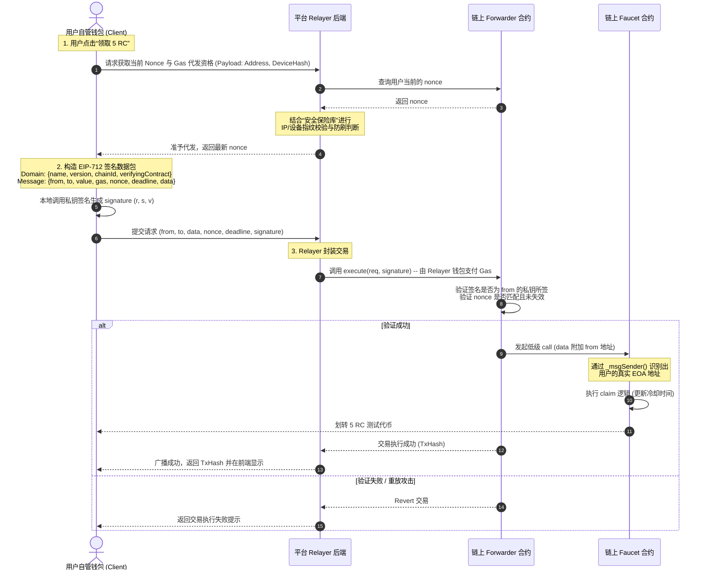

# 冷钱包 Swap 兑换与免 Gas 领取 (Gasless Faucet) 详细设计方案

## 1. 业界主流方案调研与深度评估

在 Web3 钱包的进化过程中，**DEX 兑换 (Swap)** 和 **免 Gas 体验 (Gasless)** 已成为提升用户转化率和降低摩擦的核心功能。以下是针对业界主流实现方案的对比深度评估。

### 1.1 Swap 兑换方案对比

| 评估维度 | 方案 A：自建单一/跳级路由池 (类似 Uniswap V2/V3) | 方案 B：三方 DEX 聚合器集成 (MetaMask Swap / 1inch API) |
| :--- | :--- | :--- |
| **技术原理** | 平台在自主链上部署 AMM 流动性池，前端直接读取池内 Reserves 进行本币种对兑换。 | 接入多链 DEX 聚合 API，后端动态比价，拆分订单路由至多个外部协议以获取最优价格。 |
| **适用场景** | 自主链/私有链生态，代币流动性完全由项目方或生态联合方提供。 | 以太坊/Polygon/Arbitrum 等公链生态，代币已在多个公开 DEX 建立深厚池子。 |
| **滑点控制** | 通过前端计算恒定乘积公式，结合用户指定的滑点率，在合约层进行严格的 `MinAmountOut` 校验。 | 聚合器后端动态估算 Price Impact（价格冲击），并基于滑点预测模型设定动态滑点保护。 |
| **深度评估** | **【推荐】** 本项目运行于“自主链”且代币为生态专有代币（RC/USDRs/HRCs/RSTs）。由于无外部公开 DEX，采用方案 A 配合恒定乘积流动性池是最合理且唯一的选择。 | 方案 B 依赖公链生态与庞大的套利者矩阵，在自主链上由于缺乏三方 DEX，无法实施。 |

### 1.2 免 Gas 领取 (Gasless Claim) 方案对比

| 评估维度 | 方案 A：ERC-4337 账户抽象 + Paymaster (智能账户钱包) | 方案 B：EIP-2771 元交易 (Meta-Transaction) + Relayer 转发 |
| :--- | :--- | :--- |
| **技术原理** | 用户的钱包是智能合约账户。通过 Bundler 提交 `UserOperation`，由 `Paymaster` 合约代付 Gas。 | 用户的钱包是普通 EOA 账户。用户对交易数据进行 EIP-712 签名，通过 Relayer 转发给 Forwarder 合约执行。 |
| **用户端要求** | 用户必须生成并部署 Smart Account，无法使用普通私钥导入的普通 EOA 地址。 | 兼容任意自管普通 EOA 钱包（私钥/助记词导入），无额外迁移成本。 |
| **Gas 消耗** | 相对较高（由于部署和调用智能合约账户带来的额外 Gas 摩擦）。 | 相对较低（普通的 Relayer 签名转发，无庞大的账户抽象框架开销）。 |
| **深度评估** | 代表未来趋势（如 OKX / Coinbase Wallet 的 AA 钱包），但对已有普通 EOA 钱包的 IM 用户有极高的门槛，且开发链上 Bundler 基础设施繁重。 | **【推荐】** 极度贴合本项目目前“本地导入私钥、生成自管 EOA 钱包”的现状。对用户无感知，开发成本低且能实现完美的免 Gas 领取。 |

---

## 2. Swap 兑换功能详细方案

### 2.1 滑点控制算法 (Slippage Control)

在去中心化交易中，滑点是指**交易确认时的实际执行价格**与**发起交易时的预估价格**之间的差额。为防止恶意抢跑（夹子攻击）和因池子深度不足造成的资产受损，系统引入严格的前端及合约级滑点保护。

#### 2.1.1 恒定乘积定价计算
设池中代币 A（支付）余额为 \(x\)，代币 B（接收）余额为 \(y\)，手续费率为 \(f\)（默认 0.3%）。当输入 \(dx\) 个代币 A 时，预估能兑换的代币 B 数量 \(dy\) 为：
\[dy = \frac{y \cdot dx \cdot (1 - f)}{x + dx \cdot (1 - f)}\]

#### 2.1.2 最小接收量 (MinAmountOut) 计算公式
设用户在前端设置的滑点容忍度为 \(\text{Slippage}\)（例如 \(0.5\%\)，即 \(0.005\)），则前端计算的**滑点保护下限**为：
\[dy_{\min} = dy \cdot (1 - \text{Slippage})\]
在组装链上 Swap 交易时，该 \(dy_{\min}\) 将作为核心参数随签名发送至智能合约。

#### 2.1.3 合约级防抖与校验
当交易上链执行时，路由合约必须进行如下校验：
```solidity
// UniswapV2Router 风格校验
require(amounts[amounts.length - 1] >= amountOutMin, "Router: INSUFFICIENT_OUTPUT_AMOUNT");
```
如果由于块内并发交易导致池内真实兑换得到的 \(dy_{\text{real}} < dy_{\min}\)，该笔交易将**自动 Revert（回退）**，用户仅损失少量 Gas，资产余额原路返回，从而避免遭受高额资产损失。

### 2.2 智能路由设计 (Routing Path)

为了在有限的流动性池中实现任意两个代币之间的兑换，系统设计了**两代代币路由机制**：

1.  **直连路由 (Direct Routing)**：
    *   适用场景：存在直接对交易对（如 RC $\leftrightarrow$ USDRs）。
    *   路径：`[RC, USDRs]`。
2.  **单跳中转路由 (Single-Hop Routing)**：
    *   适用场景：无直接交易对，但均与媒介代币 USDRs 拥有流动性池（如 HRCs $\leftrightarrow$ RSTs）。
    *   路径：`[HRCs, USDRs, RSTs]`。
    *   计算逻辑：先计算 HRCs $\rightarrow$ USDRs 的输出，再以此输出作为输入，计算 USDRs $\rightarrow$ RSTs 的输出。

---

## 3. 免 Gas Faucet (测试币) 详细方案

### 3.1 基于 EIP-2771 / Relayer 的元交易架构

为了实现 Faucet 中“Gas不足时由平台代发”的免 Gas 领取功能，方案采用 **EIP-2771 元交易标准**。

#### 3.1.1 核心组件
*   **EOA Wallet (自管钱包客户端)**：用户本地私钥对 `Claim` 请求进行 EIP-712 签名，但不广播交易。
*   **Relayer API (平台中继服务)**：后端 API，接收用户的请求和签名，校验合规性后，使用平台充值的“Gas Tank 钱包”代为打包广播交易。
*   **Trusted Forwarder (信托转发器合约)**：链上公共合约，负责验证用户的 EIP-712 签名，确保其未过期且 Nonce 递增，随后向 Faucet 合约发起内部调用。
*   **Faucet Contract (测试币领用合约)**：识别来自 Forwarder 的调用，并使用 `_msgSender()` 提取真实的领用人地址，执行 `transfer`。

### 3.2 详细交互时序图



### 3.3 核心 EIP-712 签名结构体 (Typed Data)
```json
{
  "types": {
    "EIP712Domain": [
      { "name": "name", "type": "string" },
      { "name": "version", "type": "string" },
      { "name": "chainId", "type": "uint256" },
      { "name": "verifyingContract", "type": "address" }
    ],
    "ForwardRequest": [
      { "name": "from", "type": "address" },
      { "name": "to", "type": "address" },
      { "name": "value", "type": "uint256" },
      { "name": "gas", "type": "uint256" },
      { "name": "nonce", "type": "uint256" },
      { "name": "deadline", "type": "uint256" },
      { "name": "data", "type": "bytes" }
    ]
  },
  "primaryType": "ForwardRequest",
  "domain": {
    "name": "IM-Eco-Forwarder",
    "version": "1.0.0",
    "chainId": 10001,
    "verifyingContract": "0xForwarderAddress..."
  }
}
```

### 3.4 结合安全保险库的防刷风控规则
由于免 Gas 机制意味着平台为用户垫付手续费，必须设置极高规格的防薅风控判定：
1.  **设备指纹强制关联**：Relayer 在准予代发交易前，必须读取数据库/合约，验证该钱包地址是否在 **安全保险库 (Vault)** 中绑定了设备指纹。**未绑定物理指纹的地址，Relayer 拒绝提供 Gas 代发服务**。
2.  **IP 频次限制**：同一出口 IP 在 24 小时内请求 Relayer 接口的频次不得超过 3 次，防止通过模拟器池批量代发。
3.  **防重放校验**：Forwarder 合约使用自增 nonce 确保同一签名只能上链执行一次。

---

## 4. 接口与数据模型定义

### 4.1 智能合约接口

#### 4.1.1 IUniswapV2Router 风格兑换接口 (Swap)
```solidity
interface IMSwapRouter {
    // 依据确定的输入代币，兑换尽可能多的输出代币 (带滑点保护)
    function swapExactTokensForTokens(
        uint amountIn,
        uint amountOutMin,
        address[] calldata path,
        address to,
        uint deadline
    ) external returns (uint[] memory amounts);

    // 依据确定的输出代币，使用尽可能少的输入代币进行兑换
    function swapTokensForExactTokens(
        uint amountOut,
        uint amountInMax,
        address[] calldata path,
        address to,
        uint deadline
    ) external returns (uint[] memory amounts);
}
```

#### 4.1.2 IMFaucet 测试币领用接口 (EIP-2771 兼容)
```solidity
contract IMFaucet is ERC2771Context {
    mapping(address => uint256) public lastClaimTime;
    uint256 public constant CLAIM_INTERVAL = 24 hours;
    uint256 public constant CLAIM_AMOUNT = 5 * 10**18; // 5 RC

    constructor(address trustedForwarder) ERC2771Context(trustedForwarder) {}

    // 领用函数，仅允许未冷却地址领取
    function claim() external {
        address recipient = _msgSender(); // 从 Forwarder 中提取真实发送者
        require(block.timestamp - lastClaimTime[recipient] >= CLAIM_INTERVAL, "Faucet: Cooldown active");
        lastClaimTime[recipient] = block.timestamp;
        
        // 执行转账 5 RC
        IERC20(rcToken).transfer(recipient, CLAIM_AMOUNT);
    }
}
```

### 4.2 Relayer 服务端 API 接口

#### 4.2.1 `GET /api/v1/faucet/pre-check` — 资格及 Nonce 预检
*   **请求参数**：
    *   `address`: 领用钱包地址
    *   `deviceHash`: 物理指纹 Hash
*   **返回 Response**：
    *   `success`: bool
    *   `nonce`: uint256 (用于 EIP-712 签名的 nonce)
    *   `allowed`: bool (是否允许由平台代发)
    *   `reason`: string (不允许时的原因，如 "未绑定保险库" 或 "正在冷却中")

#### 4.2.2 `POST /api/v1/faucet/claim-gasless` — 提交免 Gas 领取
*   **请求 Body**：
    ```json
    {
      "from": "0xUserAddress...",
      "to": "0xFaucetAddress...",
      "nonce": 12,
      "deadline": 1782938192,
      "signature": "0xSignatureBytes...",
      "deviceHash": "0xDeviceHash..."
    }
    ```
*   **返回 Response**：
    *   `success`: bool
    *   `txHash`: string (广播成功的链上交易哈希)
    *   `error`: string (执行失败的错误码描述)
