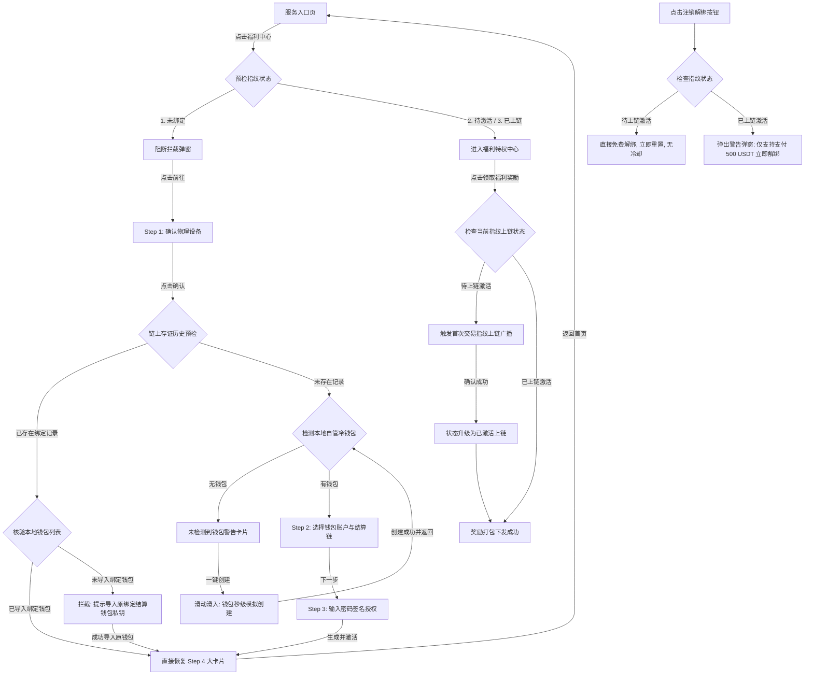

# IM 开放服务 - 安全保险库 (Vault) 与设备指纹绑定功能设计方案
**文档类型**：功能设计与产品规范 (PRD)  
**更新时间**：2026-07-02  

---

## 1. 业务背景与价值模型

> [!NOTE]
> **设计初衷**：在福利特权（空投、返利等）运营中，防范“女巫攻击”（羊毛党使用单台设备多账号切换）是核心痛点。
> 安全保险库 (Vault) 旨在通过物理设备与区块链钱包地址的排他性锁定，构筑防御屏障。

### 核心价值三要素
*   **物理级防刷**：一台物理手机同一时刻只能绑定一个钱包。由于设备硬件标识在物理上是唯一的，阻断了单台设备轮流切换上百个钱包薅羊毛的作弊行径。
*   **用户隐私合规**：设备 ID 在手机本地沙盒内经单向哈希加密生成指纹，**不传输、不保存 IMEI/MAC 等敏感原始隐私数据**，完美符合 Web3 隐私合规标准。
*   **作弊成本倒逼**：通过“已激活指纹解绑需支付 500 USDT”的硬性惩罚规则，使作弊者的批量解绑换号成本远超预期收益，从经济模型上杜绝羊毛党。

---

## 2. 核心业务逻辑规范

### 2.1 指纹凭证定义
```text
设备指纹 (Fingerprint) = SHA256 (设备硬件唯一标识符 + 钱包地址 + 网络环境)
```
*   **凭证复合展示**：系统在前端大卡片及后台审计中，均以 **“设备唯一 Hash + 冷钱包地址”** 的**双重组合凭证**进行展现，强调设备与钱包的唯一绑定关系。

### 2.2 两阶段生命周期（核心规则）

> [!IMPORTANT]
> **两阶段原则**：根据是否消耗链上广播存证，指纹生命周期严格划分为两个阶段，执行差异化的解绑策略。

| 指纹状态 | 触发条件 | 链上状态 | 撤销/解绑规则 |
| :--- | :--- | :--- | :--- |
| **1. 待激活 (Pseudo-bound)** | 在保险库完成本地签名向导 | 本地存根 (未上链) | **完全免费**，且**无冷却期限制**。支持用户随时撤销并更换钱包。 |
| **2. 已激活 (Activated)** | 首次在福利中心成功领取任一福利 | 广播存证 (已写入智能合约) | **关闭免费通道**。注销必须**付费支付 500 USDT 服务费**，解绑后设备无冷却。 |

### 2.3 状态恢复校验逻辑（防重装、重置与私钥校验拦截）
针对用户**“重新安装 App”**或**“设备恢复出厂设置”**导致本地数据丢失的场景，系统建立链上状态校验恢复机制：
*   **校验时机**：在绑定向导 **“Step 1：确认设备信息”** 点击下一步时触发。
*   **校验逻辑**：
    1.  系统使用当前设备的硬件 Hash 向区块链（或同步合约缓存后端）发起历史绑定查询。
    2.  **若未查询到历史绑定记录**：放行进入 **Step 2**（正常进行全新绑定流程）。
    3.  **若检测到已存在活跃的链上存证记录**：系统将拉取“链上已绑定的冷钱包地址”，并与当前客户端“本地已导入的自管钱包地址列表”进行校验比对：
        *   **情况 A（本地未检测到匹配钱包，即：本地导入账户列表不包含链上绑定地址）**：拦截并弹出**“导入原结算钱包核验提示”**。不论本地此时是否有其他不匹配的账户，均提示“本地未检测到绑定的冷钱包”，引导用户立即导入对应的私钥或助记词。
        *   **情况 B（本地检测到匹配钱包，即：本地导入账户列表已包含链上绑定地址）**：校验通过，自动在本地恢复指纹卡片凭证，直接跳转至 **Step 4 (绑定完成大卡片)** 状态，实现无缝恢复。

### 2.4 钱包地址被占用拦截校验与快捷解绑逻辑
为贯彻一机一包（一台物理设备同一时刻只能绑定一个冷钱包，一个冷钱包同时只能绑定一台设备）的高防防刷规则，系统在绑定向导中增加对“自管钱包链上占用状态”的校验。
*   **校验时机**：在绑定向导 **“Step 2：选择账户与链”** 点击“输入密码授权”时触发。
*   **校验逻辑**：
    1.  系统调取区块链绑定状态查询接口，检测用户当前选择的钱包地址在链上是否已关联了活跃的物理设备指纹。
    2.  **若该钱包未被任何设备占用**：通过校验，直接放行进入 **Step 3**（密码及本地签名授权）。
    3.  **若该钱包已被另一台物理设备占用**：系统执行拦截，并在容器中渲染**“钱包地址已被其它设备占用”**的警示页面：
        *   **要素透显**：显示占用该钱包的另一台设备的唯一物理 ID（缩略哈希）。
        *   **快捷解绑入口**：由于原设备可能损坏或丢失，系统在拦截界面上提供一个**“💳 付费 500 USDT 强制解绑历史锁定”**的快捷入口。
        *   **解绑处理流**：用户点击快捷解绑按钮后，系统**同样调取已激活指纹解绑支付弹窗**（即 3.3 节所述弹窗，明确透显合约地址、500.00 USDT服务费、Gas消耗提示与安全警示）。用户在弹窗中签名支付成功后，智能合约强制注销原设备的排他性绑定，释放该钱包地址，并自动放行当前用户进入 **Step 3** 完成绑定。

---

## 3. 用户体验 (UX) 交互流程

### 3.1 完整端到端交互流程图



### 3.2 极简向导绑定流细节 (Stepper Wizard)
绑定指纹采用向导式交互，将复杂的多链及密码机制拆解为四个步骤：
1.  **Step 1：自检确认设备与链上校验**：
    *   *链上核验*：点击确认后发起链上状态核验。
    *   *恢复拦截*：若检测到设备已被绑定，核验当前本地是否导入该钱包。若已导入匹配，直接恢复卡片；若未导入，阻断并展示“导入对应私钥”提示，引导用户导入原绑定冷钱包。
2.  **Step 2：配置钱包账户与链**：
    *   *常规状态*：同屏提供冷钱包的多账户选择列表，以及多链网格单选（链 X/Y/Z）。
    *   *无钱包状态*：若本地未检测到冷钱包，展示警告并提供**“一键新建自管钱包”**快捷通道，引导自动生成账户并无缝返回。
3.  **Step 3：输入密码签名授权**：引导用户输入冷钱包本地解密密码，调用 Secure Enclave 芯片在本地生成防篡改的安全签名凭证。
4.  **Step 4：生成大卡片**：展示带有芯片拟态与流光外观的“设备组合凭证大卡片”，表明保护已锁定。

### 3.3 已激活指纹解绑支付弹窗规范 (Pay-Unbind Modal Spec)
针对已激活（已上链广播存证）状态下的物理指纹强制注销/解绑场景，系统必须拉起一个底部的“解绑付费弹窗”，弹窗需展示完整的链上交互要素与风险警告提示：

*   **支付与合约关键要素**：
    1.  **合约地址 (Contract Address)**：清晰展示负责设备解绑与服务费托管的智能合约地址（如 `0x9fC2...98A5` / `Vault Registry`）。
    2.  **所需币种 (Currency)**：明确币种及运行网络（例如 `USDT (自主链)`）。
    3.  **所需金额 (Amount)**：明确标明解绑通道服务费数值（默认 `500.00 USDT`）。
*   **Gas 消耗小提示 (Gas Tip)**：
    *   *文案规范*：明确提醒“本操作需要在链上发起解绑交易，将消耗您自管钱包中少量的 Gas 费（如少量 RC 代币，具体数量以钱包插件广播为准，请确保钱包存有少量 RC 余额）”。
*   **其他相关警示提示 (Security Warnings)**：
    *   *排他关系撤销说明*：明确提示“支付并解绑后，本设备与当前冷钱包的排他锁死关系将被彻底抹除”。
    *   *特权归零风险*：警示用户“解绑操作会同步清空此物理指纹在当前冷钱包的全部待激活福利权益，且不可恢复”。
    *   *去冷却规则*：提示用户“付费解绑为通道即时重置，解绑完成后物理设备可立即绑定新钱包，无额外冷却冷静锁定”。

---

## 4. 后台管理与集成规范

安全保险库服务应当作为统一管理平台的一个基础安全子模块进行注册，并在后台提供相应的管理能力：
*   **上链核验接口支持**：提供高并发的设备 Hash 状态校验接口，供客户端在 Step 1 瞬间核验该设备在智能合约中的活跃绑定关联与所对应的钱包地址。
*   **参数动态配置**：支持运营人员在后台动态调节付费重置服务费数额（默认 500 USDT）。
*   **付费解锁对账流水**：对所有支付 500 USDT 进行强制解绑重置的交易，提供专项财务和日志审计流水，包含：`已解绑设备Hash`、`已解绑钱包地址`、`支付交易 TxHash`。
*   **管理员控制台干预**：支持管理员在后台对于异常刷取设备进行直接拉黑，阻止该物理 Hash 重新生成 any 指纹。
