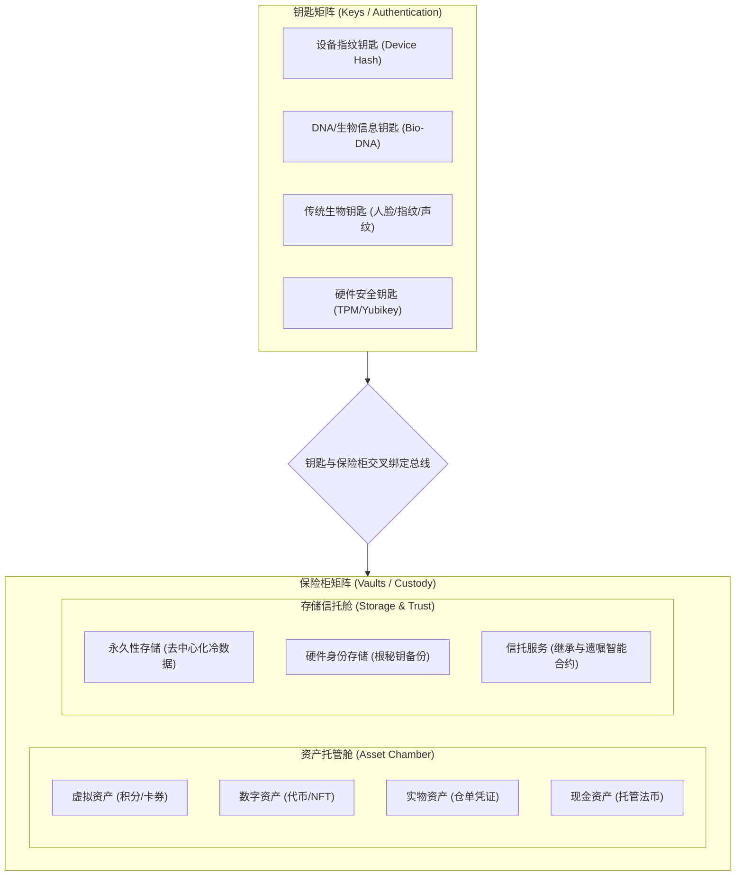

# IM 开放服务 - 安全保险库 (Vault) 未来维度扩展架构设计方案
**文档类型**：未来架构规划与概念设计 (Architecture Proposal)  
**设计版本**：v1.0 (预留准备版)  
**更新时间**：2026-07-02  

---

## 1. 概念核心：钥匙 (Keys) 与 保险柜 (Vaults)

为了支持保险库服务从当前的“设备防女巫单点锁定”演进为集团级别的“全场景资产与身份托管中枢”，系统在底层架构设计上必须进行**彻底的解耦**。

整个核心实体抽象为两大矩阵：
*   **钥匙 (Keys) —— 鉴权与身份矩阵**：负责“我是谁”以及“以何种安全级别完成解密授权”。钥匙具有多模态、可组合、可迭代升级的特性。
*   **保险柜 (Vaults) —— 托管与服务矩阵**：负责“存什么”以及“依据何种业务规则分发与处置”。保险柜包含多维资产托管舱与高安全存储空腔。




---

## 2. 钥匙 (Keys) —— 多模态鉴权矩阵

钥匙层代表访问保险柜的凭证接口（Credential Provider）。未来设计采用**适配器模式 (Adapter Pattern)**，确保任意新型安全验证钥匙只需实现通用接口，即可即插即用。

### 2.1 钥匙类型预留
*   **设备物理指纹钥匙 (Device Key)**：即当前已实现的方案。通过本地 Secure Enclave 芯片硬件特征与冷钱包私钥复合生成的排他性锁。
*   **DNA/高阶生物钥匙 (Biometric DNA Key)**：通过对极高隐私级别的脱氧核糖核酸特征数据（或其单向哈希转换值）进行非对称密钥加密，作为不可篡改的终身数字身份钥匙。
*   **传统物理生物钥匙 (Physical Bio-Key)**：集成系统级的人脸识别 (FaceID)、虹膜扫描、物理指纹、声纹等，通过沙盒核验转换为解锁签名。
*   **硬件密码芯片钥匙 (Hardware HSM Key)**：通过物理硬件口令卡、TPM 2.0 安全芯片或外接硬件冷钱包等提供物理隔离的多重签名生成。

### 2.2 钥匙等级分类与交叉鉴权 (Level Matrix)
不同的保险柜舱体需要不同安全等级的钥匙：
*   **L1 级保护**（如读取卡券积分）：单钥匙解锁（如设备指纹）。
*   **L2 级保护**（如中额数字资产转移）：双钥匙交叉认证（设备指纹 + 虹膜/声纹）。
*   **L3 级极高安全保护**（如信托协议修改、永久身份根密钥找回）：物理硬件钥匙 + DNA 终身生物识别验证 + 跨链智能多签。

---

## 3. 保险柜 (Vaults) —— 多维托管与存储空间

保险柜是具体的服务和存储容器。系统将保险柜划分为**资产托管舱 (Asset Chamber)** 和 **存储信托舱 (Storage & Trust Chamber)**。

### 3.1 资产托管舱 (Asset Chamber)
提供端到端的各类资产安全锁死与按规下发方案：
*   **虚拟资产舱 (Virtual Assets)**：
    *   *业务范畴*：平台积分、会员权益特权、空投资格白名单、游戏代币、灰度内测额度。
    *   *特点*：高频读写，通常无需直接消耗物理链上 Gas，主要依赖链下高并发账本保护。
*   **数字资产舱 (Digital Assets)**：
    *   *业务范畴*：加密货币 (Coins/Tokens)、稳定币 (USDT/USDR)、非同质化凭证 (NFTs)。
    *   *特点*：物理级广播存证，要求多签授权 (Multi-Sig) 及智能合约动态锁仓。
*   **实物资产舱 (Physical Assets)**：
    *   *业务范畴*：贵金属实物托管权、安全寄存柜物权凭证、大宗商品仓单。
    *   *特点*：与线下物理交割系统打通，通过数字凭证的转移实现所有权变更。
*   **现金/法币资产舱 (Cash/Fiat Assets)**：
    *   *业务范畴*：商户担保结算款、法定货币余额托管、联名合伙人分红储备。
    *   *特点*：严格符合传统银行托管（Escrow）合规，支持多方授权释放或条件性法币冻结。

### 3.2 存储信托舱 (Storage & Trust Chamber)
提供不可篡改的绝密数据持久化及规则自动化执行：
*   **永久性冷数据存储 (Permanent Storage)**：
    *   *业务范畴*：加密私人日记、遗嘱合同副本、历史交易存证、核心商业机密文件。
    *   *特点*：基于去中心化存储网络 (如 IPFS / Filecoin / Arweave) 进行分片加密存储，一旦写入，物理上永久保存且无法被任何人（包括平台）删除。
*   **硬件身份与密钥存储 (Hardware DID Storage)**：
    *   *业务范畴*：去中心化身份凭证 (DID)、社交恢复钱包的辅助私钥碎片、第三方服务 API 密钥。
    *   *特点*：存储在设备本地安全芯片中，仅可通过保险柜中授权的对应钥匙进行激活解密。
*   **智能信托与继承服务 (Smart Trust / Estate)**：
    *   *业务范畴*：家族信托分发规则、定向条件赠予（如“结婚时自动分发数字资产”）、遗嘱自动继承协议（如“设备指纹连续 180 天未活跃，自动激活继承人多签划转”）。
    *   *特点*：基于链上图灵完备的智能合约 (Smart Contract)，规则写死在链上，免受任何人为主观干预，实现绝对的客观执行。

---

## 4. 钥匙与保险柜的绑定总线规则 (Decoupled Binding Protocol)

```text
+------------------+                   +------------------+
|   Keys Manager   |                   |  Vaults Manager  |
|  (钥匙管理模块)  |                   |  (保险柜管理模块)|
+--------+---------+                   +--------+---------+
         |                                      |
         |         1. Request Access            |
         +------------------------------------->|
         |                                      |
         |         2. Query Key Policy          |
         |<-------------------------------------+
         |                                      |
         |         3. Perform Auth (Signature)  |
         +------------------------------------->|
         |                                      |
         |         4. Unlock & Process Action   |
         |<-------------------------------------+
```

### 核心规则：
1.  **多对多解耦映射**：一个保险柜可以绑定多把钥匙（备份防丢失），一把钥匙也可以作为多重签名的一部分去打开不同的保险柜。
2.  **安全隔离屏障**：钥匙层只向保险柜层输出**签名核验结果 (Verification Signature)**，决不泄露钥匙所包含的底层硬件隐私或生物隐私原始数据。
3.  **防灾备机制（社交恢复与信托兜底）**：若核心钥匙（如设备硬件/生物钥匙）永久性丢失，用户可通过预设在“信托与继承服务”中的**外部托管多签恢复机制**（如 3/5 社交密友签名，或律师加公证处多签核验），向保险柜申请“解除旧钥匙绑定并注入新钥匙”，避免资产成为永久死锁的僵尸资产。

---

## 5. 后续演进路径建议 (Architecture Roadmap)

*   **Phase 1：基础夯实期** (当前阶段)
    *   完善单通道“设备唯一指纹”与“虚拟资产/特权中心”的硬性排他性绑定。
    *   打通首次上链及 500 USDT 强制解绑业务链条。
*   **Phase 2：钥匙与业务线横向扩展**
    *   **钥匙侧**：引入手机系统的原生人脸 (FaceID) / 指纹硬件适配，开启“设备指纹 + 生物指纹”双钥匙机制。
    *   **保险柜侧**：引入“数字资产舱”，支持通过保险库多签转移冷钱包内的高额代币及 NFT。
*   **Phase 3：高阶服务纵向延伸**
    *   **钥匙侧**：探索科研级的 DNA / 虹膜等高阶防伪物理特征加密适配器。
    *   **保险柜侧**：全面上线“永久冷数据加密存储”与“智能信托继承合约”，开启去中心化的家族数字信托托管服务。
