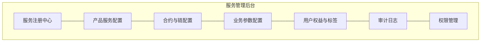
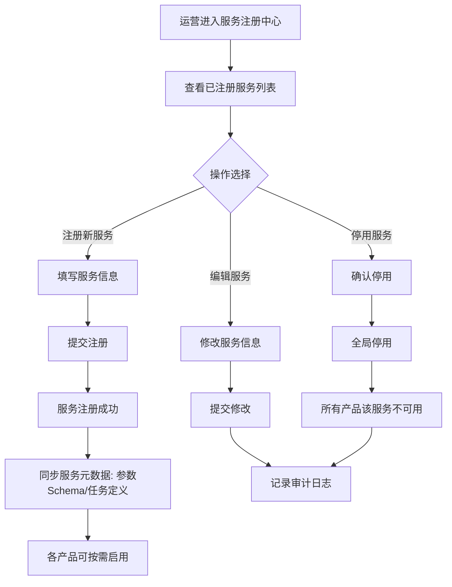
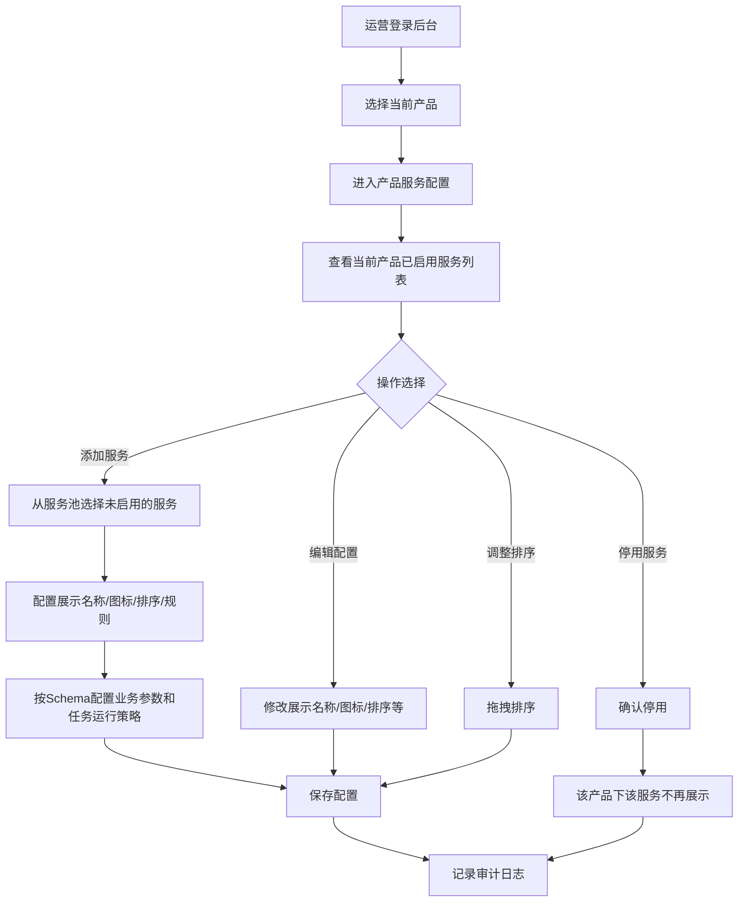
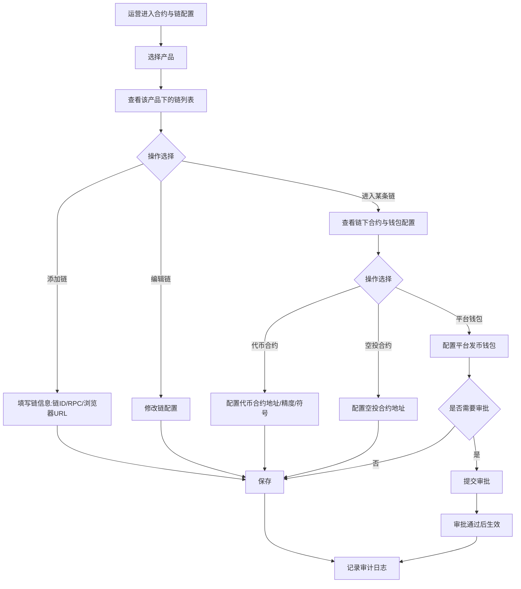
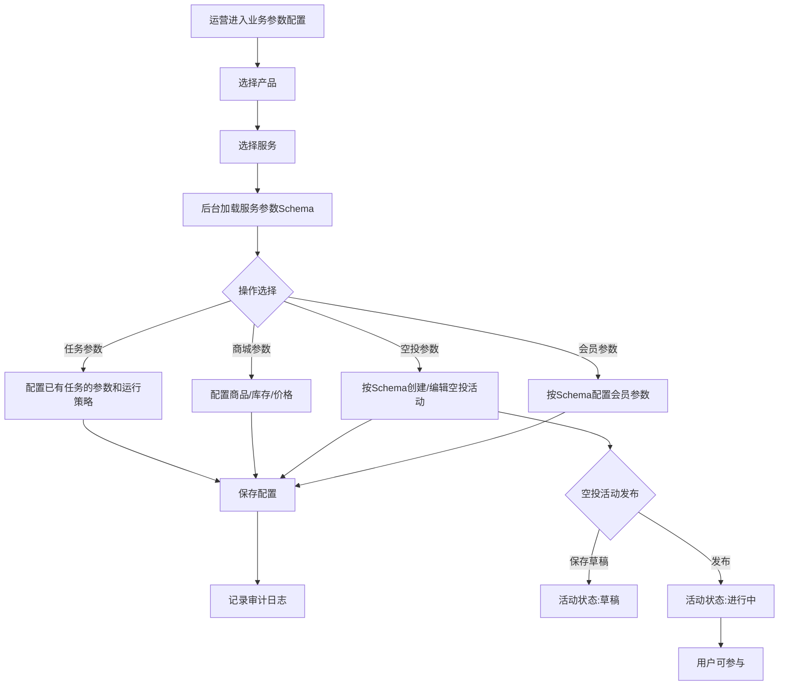
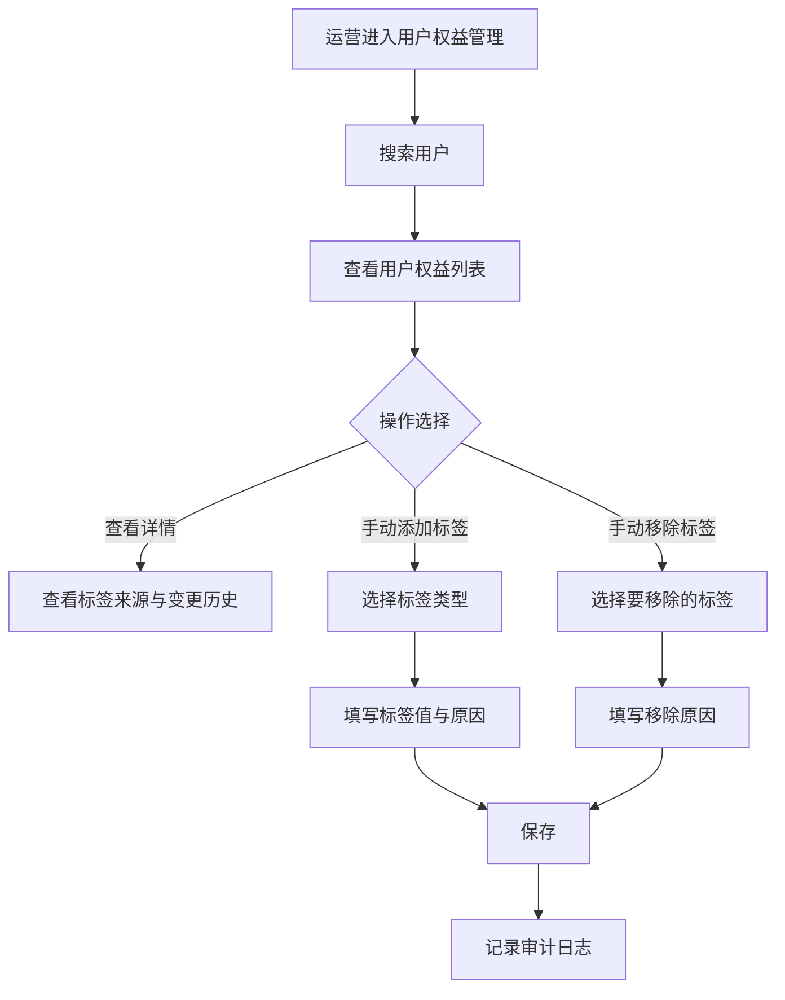
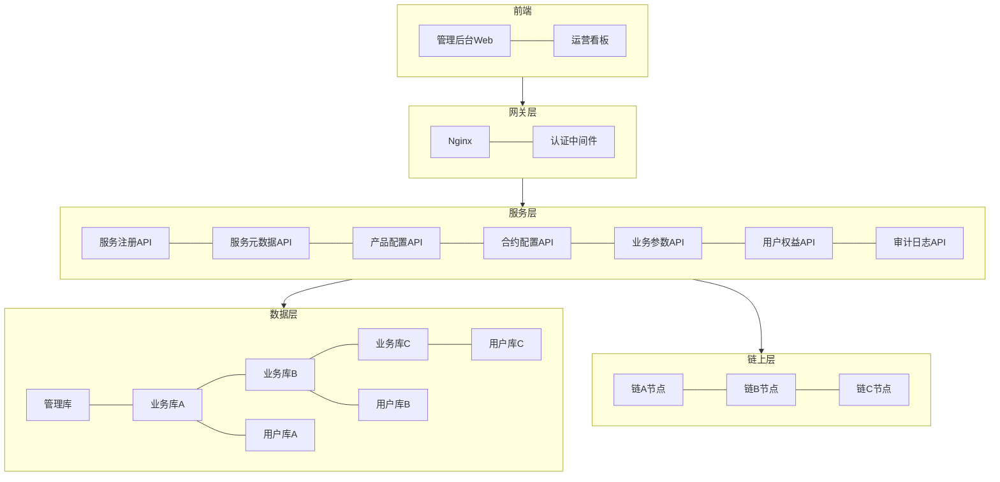
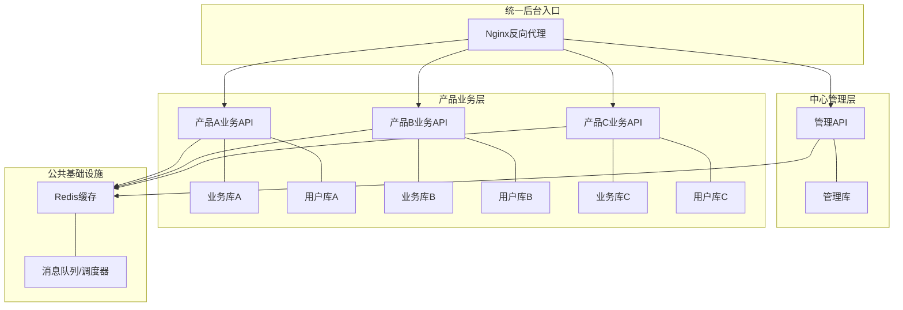
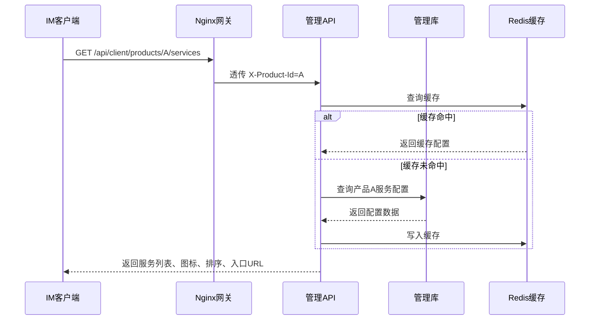
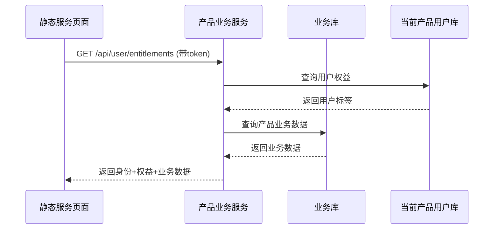

# IM 开放服务 — 服务管理后台详细方案

> 基于已确认原则：服务独立于产品，开发一次三个产品都能用，后台统一入口按产品切换。

---

## 一、后台定位与核心原则

### 1.1 定位

服务管理后台是 IM 开放服务的管理中枢，基于 homeserver，统一管理所有开放服务的配置、合约、参数、用户权益和审计日志。

### 1.2 核心原则

| 原则 | 说明 |
|------|------|
| 服务独立于产品 | 服务在注册中心统一注册，各产品按需启用 |
| 配置按产品隔离 | 同一服务在不同产品中可配置不同参数，链与产品绑定 |
| 用户按产品隔离 | 三个 IM 产品的用户、钱包、权益、订单和领取记录互不共享 |
| 服务元数据驱动 | 服务代码声明任务定义和参数Schema，后台同步后渲染配置 |
| 中心化管理 | 一套管理后台统一管理服务、产品配置、权限和审计，产品业务服务可分实例部署 |
| 统一入口 | 运营一个入口登录，切换产品维度操作 |
| 所有关键操作可审计 | 配置变更、合约参数、发币、权益变更全部留痕 |

---

## 二、后台功能模块总览



---

## 三、模块一：服务注册中心

### 3.1 功能说明

所有开放服务在此统一注册。新增服务只需注册，各产品按需启用，不需要改客户端。

### 3.2 功能清单

| 功能 | 说明 |
|------|------|
| 注册新服务 | 填写服务标识、名称、描述、默认图标、默认入口URL |
| 编辑服务信息 | 修改服务名称、描述、图标等 |
| 启用/停用服务 | 全局开关，停用后所有产品不可用 |
| 查看服务列表 | 查看所有已注册服务及其状态 |
| 查看服务被哪些产品启用 | 查看服务的使用情况 |
| 同步服务元数据 | 同步服务代码声明的参数Schema和任务定义 |

### 3.3 运营流程



### 3.4 数据模型

**service_registry（服务注册表）**

| 字段 | 类型 | 说明 |
|------|------|------|
| id | VARCHAR | 主键 |
| service_key | VARCHAR | 服务标识，如 member / airdrop / shop |
| service_name | VARCHAR | 服务名称 |
| description | TEXT | 服务描述 |
| default_icon_url | VARCHAR | 默认图标URL |
| default_entry_url | VARCHAR | 默认静态入口URL |
| status | ENUM | active / inactive |
| created_at | TIMESTAMP | 创建时间 |
| updated_at | TIMESTAMP | 更新时间 |

**service_param_definition（服务参数定义表）**

| 字段 | 类型 | 说明 |
|------|------|------|
| id | VARCHAR | 主键 |
| service_id | VARCHAR | 关联服务注册表ID |
| param_key | VARCHAR | 参数Key |
| param_name | VARCHAR | 参数显示名称 |
| param_scope | ENUM | biz / job |
| schema | JSON | 字段类型、默认值、校验规则、数据来源 |
| version | VARCHAR | 服务版本 |
| status | ENUM | active / deprecated |

**service_job_definition（服务任务定义表）**

| 字段 | 类型 | 说明 |
|------|------|------|
| id | VARCHAR | 主键 |
| service_id | VARCHAR | 关联服务注册表ID |
| job_key | VARCHAR | 任务Key，由服务代码定义 |
| job_name | VARCHAR | 任务名称 |
| job_type | ENUM | active / passive |
| params_schema | JSON | 任务执行参数Schema |
| default_cron | VARCHAR | 服务建议默认cron，可为空 |
| version | VARCHAR | 服务版本 |
| status | ENUM | active / deprecated |

> 服务任务和参数字段由服务开发侧随代码发布声明，后台通过 manifest、发布流程或服务元数据接口同步。运营不能手工新增服务代码不存在的任务Key或参数字段。

---

## 四、模块二：产品服务配置

### 4.1 功能说明

为每个 IM 产品配置启用哪些服务，以及各服务的展示方式和交互规则。

### 4.2 功能清单

| 功能 | 说明 |
|------|------|
| 切换产品维度 | 顶部切换当前操作的产品（A/B/C） |
| 启用服务 | 从服务注册中心选择服务，启用到当前产品 |
| 停用服务 | 停用当前产品的某个服务 |
| 配置展示名称 | 自定义服务在当前产品的展示名称 |
| 配置图标 | 自定义服务在当前产品的图标 |
| 配置入口URL | 自定义服务在当前产品的静态入口地址 |
| 配置排序 | 拖拽或输入排序值 |
| 配置是否需要登录 | 进入该服务是否需要登录态 |
| 配置是否需要钱包 | 进入该服务是否需要绑定钱包（平台托管/自管/外部） |
| 配置业务参数 | 根据服务参数定义表中的Schema填写当前产品的实际值 |
| 配置定时任务 | 根据服务任务定义表配置当前产品的启停、cron、时区、执行参数和重试策略 |
| 批量操作 | 批量启用/停用/排序 |

### 4.2.1 服务元数据与产品配置边界

| 层级 | 负责内容 | 是否可由运营新增 |
|------|----------|------------------|
| 服务代码/服务元数据 | 服务有哪些业务参数、任务、任务参数、字段类型、默认值、校验规则 | 否 |
| 后台管理系统 | 同步服务元数据，渲染表单，校验输入，保存产品配置值 | 否 |
| 产品服务配置 | 当前产品对这些参数和任务的具体取值、启停和运行策略 | 是，仅限填写和调整已有字段 |

### 4.3 运营流程



### 4.4 数据模型

**product_service_config（产品服务配置表）**

| 字段 | 类型 | 说明 |
|------|------|------|
| id | VARCHAR | 主键 |
| product_id | VARCHAR | 产品ID |
| service_id | VARCHAR | 关联服务注册表ID |
| display_name | VARCHAR | 展示名称 |
| icon_url | VARCHAR | 图标URL |
| entry_url | VARCHAR | 静态入口URL |
| sort_order | INT | 排序值 |
| enabled | BOOLEAN | 是否启用 |
| required_login | BOOLEAN | 是否需要登录 |
| required_wallet | BOOLEAN | 是否需要钱包绑定 |
| feature_flags | JSON | 特性开关 |
| created_at | TIMESTAMP | 创建时间 |
| updated_at | TIMESTAMP | 更新时间 |

**product_service_job_config（产品服务任务配置表）**

| 字段 | 类型 | 说明 |
|------|------|------|
| id | VARCHAR | 主键 |
| product_id | VARCHAR | 产品ID |
| product_service_id | VARCHAR | 关联产品服务配置 |
| job_definition_id | VARCHAR | 关联服务任务定义 |
| enabled | BOOLEAN | 当前产品是否启用该任务 |
| cron_expression | VARCHAR | 当前产品实际cron |
| timezone | VARCHAR | 时区，默认 Asia/Shanghai |
| params | JSON | 当前产品任务参数值 |
| retry_policy | JSON | 失败重试策略 |
| status | ENUM | active / paused |
| last_run_at | TIMESTAMP | 上次执行时间 |
| next_run_at | TIMESTAMP | 下次执行时间 |

---

## 五、模块三：合约与链配置

### 5.1 功能说明

链与产品绑定，每个 IM 产品有自己对接的链及对应的合约、钱包配置。运营需先选择产品，再管理该产品下的链和合约参数。

### 5.2 核心关系

```
产品 A
  ├─ 链 X
  │   ├─ 代币合约
  │   ├─ 空投合约
  │   └─ 平台发币钱包
  └─ 链 Y
      ├─ 代币合约
      └─ 平台发币钱包

产品 B
  └─ 链 Z
      ├─ 代币合约
      └─ 平台发币钱包

产品 C
  ├─ 链 X
  └─ 链 Z
```

### 5.3 功能清单

| 功能 | 说明 |
|------|------|
| 选择产品 | 先选择当前操作的产品 |
| 链管理 | 为该产品添加/编辑/停用链（链ID、链名称、RPC节点、浏览器URL） |
| 代币合约管理 | 配置该产品下各链的代币合约地址、精度、符号 |
| 空投合约管理 | 配置该产品下各链的空投合约地址 |
| 平台发币钱包 | 配置该产品下各链的平台热钱包地址 |
| Gas 币配置 | 配置该产品下各链的原生 gas 币信息 |
| 参数变更审批 | 合约参数变更需审批（可选） |

### 5.4 运营流程



### 5.5 数据模型

**product_chain_config（产品链配置表）**

| 字段 | 类型 | 说明 |
|------|------|------|
| id | VARCHAR | 主键 |
| product_id | VARCHAR | 产品ID |
| chain_id | VARCHAR | 链ID |
| chain_name | VARCHAR | 链名称 |
| rpc_url | VARCHAR | RPC节点地址 |
| explorer_url | VARCHAR | 区块浏览器URL |
| gas_token_symbol | VARCHAR | Gas币符号，如 RC |
| gas_token_decimals | INT | Gas币精度 |
| status | ENUM | active / inactive |
| created_at | TIMESTAMP | 创建时间 |
| updated_at | TIMESTAMP | 更新时间 |

**product_contract_config（产品合约配置表）**

| 字段 | 类型 | 说明 |
|------|------|------|
| id | VARCHAR | 主键 |
| product_id | VARCHAR | 产品ID |
| chain_id | VARCHAR | 链ID（关联产品链配置表） |
| contract_type | ENUM | token / airdrop / membership / shop |
| contract_address | VARCHAR | 合约地址 |
| contract_name | VARCHAR | 合约名称 |
| token_symbol | VARCHAR | 代币符号，如 USDR、HRC |
| token_decimals | INT | 代币精度 |
| platform_wallet_address | VARCHAR | 平台发币钱包地址 |
| status | ENUM | active / inactive |
| created_at | TIMESTAMP | 创建时间 |
| updated_at | TIMESTAMP | 更新时间 |

---

## 六、模块四：业务参数配置

### 6.1 功能说明

各服务按产品维度独立配置业务参数。参数字段、字段类型、默认值、校验规则和数据来源由服务元数据中的 `service_param_definition.schema` 定义，后台按Schema动态渲染配置表单；运营只填写当前产品的具体参数值。

### 6.2 参数配置方式

| 配置项 | 说明 |
|--------|------|
| 参数定义来源 | 服务开发侧随服务代码声明，后台通过元数据同步 |
| 表单渲染 | 后台根据Schema渲染输入框、开关、枚举、链选择、合约选择等控件 |
| 数据校验 | 前端做基础校验，后端按Schema做最终校验 |
| 数据保存 | 仅保存当前产品的参数值，不保存临时新增字段定义 |
| 数据来源 | 支持固定枚举、当前产品链、当前产品合约、用户标签等后台数据源 |

### 6.3 参数示例

#### 会员服务参数示例

| 参数 | 说明 |
|------|------|
| plans | 会员套餐列表，包含价格、周期、权益文案 |
| external_wallet_payment | 是否支持外部钱包支付 |
| auto_renew | 是否开启自动续费 |

#### 激励空投参数示例

| 参数 | 说明 |
|------|------|
| campaign_type | 普通空投 / 持仓返利 |
| token_contract | 从当前产品已配置代币合约中选择（如 USDR、HRC） |
| total_amount | 本次空投总量 |
| claim_mode | 后台代发 / 合约Claim |
| eligibility_rule | 资格规则或白名单来源（运营预配置，服务端请求并核验） |

#### 持仓返利参数示例

> 持仓返利是持有代币按持仓比例获得代币返利，返利发放的也是代币（如USDR），非Gas原生代币免除。

| 参数 | 说明 |
|------|------|
| campaign_type | 持仓返利 |
| token_contract | 持仓统计代币合约 |
| reward_token_contract | 奖励代币合约（发放的代币，如 USDR） |
| total_amount | 本次返利总量 |
| snapshot_interval | 快照周期（daily / weekly / monthly） |
| claim_mode | 后台代发 / 合约Claim |

#### 定时任务参数示例

定时任务参数由 `service_job_definition.params_schema` 定义，并在产品服务任务配置中保存实际值。

| 任务 | 参数示例 | 说明 |
|------|----------|------|
| holding_snapshot | chain_id / token_contract / min_balance | 按产品配置统计链、统计代币和最小持仓 |
| campaign_status_check | campaign_scope | 配置检查全部活动或指定活动范围 |
| reward_settlement | settlement_window / max_batch_size | 配置结算周期和单批处理数量 |

#### 硬件商城参数

| 参数 | 说明 |
|------|------|
| 商品名称 | 手机型号 |
| 商品价格 | 售价 |
| 库存数量 | 可售数量 |
| 限购数量 | 每人限购 |
| 支付方式 | 平台余额/链上支付 |
| 上下架状态 | 上架/下架 |

### 6.4 运营流程



### 6.5 数据模型

**product_service_param（业务参数配置表）**

| 字段 | 类型 | 说明 |
|------|------|------|
| id | VARCHAR | 主键 |
| product_id | VARCHAR | 产品ID |
| service_key | VARCHAR | 服务标识 |
| param_key | VARCHAR | 参数键 |
| param_value | JSON | 参数值（JSON格式，支持复杂结构） |
| version | INT | 配置版本 |
| status | ENUM | active / inactive |
| created_at | TIMESTAMP | 创建时间 |
| updated_at | TIMESTAMP | 更新时间 |

**airdrop_campaign（空投活动表）**

| 字段 | 类型 | 说明 |
|------|------|------|
| id | VARCHAR | 主键 |
| product_id | VARCHAR | 产品ID |
| campaign_name | VARCHAR | 活动名称 |
| campaign_type | ENUM | token_drop / holding_reward |
| category | ENUM | airdrop / rebate / ecology / vip / referral，活动分类，用于前端Tab筛选和记录分类 |
| chain_id | VARCHAR | 链ID |
| token_contract | VARCHAR | 代币合约地址 |
| reward_token_contract | VARCHAR | 奖励代币合约（持仓返利时，如 USDR） |
| total_amount | DECIMAL | 活动总额度 |
| rewards | JSON | 多奖励项数组，每项含 id/title/amount/tokenSymbol/claimMode |
| start_time | TIMESTAMP | 开始时间 |
| end_time | TIMESTAMP | 结束时间 |
| claim_mode | ENUM | backend_transfer / contract_claim |
| snapshot_interval | ENUM | daily / weekly / monthly |
| status | ENUM | draft / active / paused / ended |
| created_at | TIMESTAMP | 创建时间 |
| updated_at | TIMESTAMP | 更新时间 |

> **rewards 数组结构说明：**
> ```json
> [
>   {
>     "id": "reward_001",
>     "title": "持仓返利-基础奖励",
>     "amount": "100.00",
>     "tokenSymbol": "USDR",
>     "claimMode": "AUTO"
>   },
>   {
>     "id": "reward_002",
>     "title": "持仓返利-VIP加成",
>     "amount": "50.00",
>     "tokenSymbol": "HRC",
>     "claimMode": "MANUAL"
>   }
> ]
> ```

**claim_record（领取记录表）**

| 字段 | 类型 | 说明 |
|------|------|------|
| id | VARCHAR | 主键 |
| product_id | VARCHAR | 产品ID |
| user_id | VARCHAR | 用户ID |
| campaign_id | VARCHAR | 关联空投活动ID |
| reward_id | VARCHAR | 关联rewards数组中的奖励项ID |
| category | ENUM | airdrop / rebate / ecology / vip / referral |
| claim_type | ENUM | MANUAL / AUTO |
| amount | DECIMAL | 领取数量 |
| tx_hash | VARCHAR | 链上交易哈希 |
| chain_id | VARCHAR | 链ID |
| status | ENUM | pending / confirmed / failed |
| created_at | TIMESTAMP | 创建时间 |

**shop_product（商城商品表）**

| 字段 | 类型 | 说明 |
|------|------|------|
| id | VARCHAR | 主键 |
| product_id | VARCHAR | 产品ID |
| product_name | VARCHAR | 商品名称 |
| price | DECIMAL | 价格 |
| stock | INT | 库存 |
| purchase_limit | INT | 限购数量 |
| payment_methods | JSON | 支持的支付方式 |
| status | ENUM | on_sale / off_sale |
| created_at | TIMESTAMP | 创建时间 |
| updated_at | TIMESTAMP | 更新时间 |

---

## 七、模块五：用户权益与标签

### 7.1 功能说明

统一管理用户在各服务中的身份和权益。用户体系按产品隔离，后台必须先选择产品，再查询该产品内的用户权益；同一个 `user_id` 在不同产品中视为不同用户。

### 7.2 功能清单

| 功能 | 说明 |
|------|------|
| 查询用户权益 | 按产品 + 用户ID查询当前产品内的权益标签 |
| 手动添加标签 | 运营手动为用户添加标签 |
| 手动移除标签 | 运营手动移除用户标签 |
| 标签类型管理 | 管理可用的标签类型 |
| 权益变更记录 | 查看用户权益变更历史 |

### 7.3 标签体系

| 标签类型 | 标签值 | 来源 |
|----------|--------|------|
| member | active / expired | 会员服务自动写入 |
| wallet_bound | platform / cold（自管钱包） / external | 钱包绑定服务自动写入 |
| hardware_buyer | active / refunded / revoked | 商城订单支付后自动写入 |
| airdrop_claimed | campaign_id | 空投领取后自动写入 |
| risk_limited | limited / normal | 风控系统写入 |

### 7.4 运营流程



### 7.5 数据模型

**user_entitlement（用户权益表）**

| 字段 | 类型 | 说明 |
|------|------|------|
| id | VARCHAR | 主键 |
| product_id | VARCHAR | 产品ID |
| user_id | VARCHAR | 用户ID |
| tag_type | VARCHAR | 标签类型 |
| tag_value | VARCHAR | 标签值 |
| source_service | VARCHAR | 来源服务 |
| source_id | VARCHAR | 来源ID（如订单ID、活动ID） |
| status | ENUM | active / revoked |
| expires_at | TIMESTAMP | 过期时间（可选） |
| created_at | TIMESTAMP | 创建时间 |
| updated_at | TIMESTAMP | 更新时间 |

**entitlement_change_log（权益变更日志表）**

| 字段 | 类型 | 说明 |
|------|------|------|
| id | VARCHAR | 主键 |
| product_id | VARCHAR | 产品ID |
| entitlement_id | VARCHAR | 权益ID |
| user_id | VARCHAR | 用户ID |
| action | ENUM | add / remove / update |
| old_value | VARCHAR | 变更前值 |
| new_value | VARCHAR | 变更后值 |
| operator | VARCHAR | 操作人（系统/运营） |
| reason | VARCHAR | 变更原因 |
| created_at | TIMESTAMP | 创建时间 |

---

## 八、模块六：审计日志

### 8.1 功能说明

所有关键操作留痕，支持查询和追溯。

### 8.2 审计范围

| 模块 | 审计内容 |
|------|---------|
| 服务注册 | 服务新增/编辑/停用 |
| 产品服务配置 | 启用/停用/排序/参数变更 |
| 合约配置 | 链/合约/钱包地址变更 |
| 业务参数 | 会员/空投/商城参数变更 |
| 用户权益 | 标签添加/移除/变更 |
| 发币操作 | 空投发放/持仓返利发放 |
| 钱包绑定 | 绑定/解绑操作 |
| 订单 | 支付/退款操作 |

### 8.3 功能清单

| 功能 | 说明 |
|------|------|
| 按模块筛选 | 选择模块查看审计日志 |
| 按时间范围 | 指定时间区间 |
| 按操作人 | 按运营人员筛选 |
| 按产品 | 按产品维度筛选 |
| 日志详情 | 查看变更前后的值 |

### 8.4 数据模型

**audit_log（审计日志表）**

| 字段 | 类型 | 说明 |
|------|------|------|
| id | VARCHAR | 主键 |
| product_id | VARCHAR | 产品ID |
| module | VARCHAR | 模块名称 |
| action | VARCHAR | 操作类型 |
| target_type | VARCHAR | 操作对象类型 |
| target_id | VARCHAR | 操作对象ID |
| old_value | JSON | 变更前值 |
| new_value | JSON | 变更后值 |
| operator_id | VARCHAR | 操作人ID |
| operator_name | VARCHAR | 操作人名称 |
| ip_address | VARCHAR | 操作IP |
| created_at | TIMESTAMP | 创建时间 |

---

## 九、模块七：权限管理

### 9.1 功能说明

控制不同运营人员可操作的功能范围。

### 9.2 角色设计

| 角色 | 权限范围 |
|------|---------|
| 超级管理员 | 所有模块全部权限 |
| 运营 | 服务配置、业务参数、用户权益查看 |
| 财务 | 合约配置、发币记录、审计日志 |
| 审计员 | 仅查看审计日志 |

### 9.3 权限矩阵

| 模块 | 超级管理员 | 运营 | 财务 | 审计员 |
|------|-----------|------|------|--------|
| 服务注册 | 读写 | 只读 | - | - |
| 产品服务配置 | 读写 | 读写 | - | - |
| 合约与链配置 | 读写 | - | 读写 | - |
| 业务参数配置 | 读写 | 读写 | - | - |
| 用户权益 | 读写 | 只读 | - | - |
| 审计日志 | 只读 | - | 只读 | 只读 |
| 权限管理 | 读写 | - | - | - |

### 9.4 数据模型

**admin_role（角色表）**

| 字段 | 类型 | 说明 |
|------|------|------|
| id | VARCHAR | 主键 |
| role_name | VARCHAR | 角色名称 |
| permissions | JSON | 权限列表 |
| created_at | TIMESTAMP | 创建时间 |

**admin_user（管理员表）**

| 字段 | 类型 | 说明 |
|------|------|------|
| id | VARCHAR | 主键 |
| username | VARCHAR | 用户名 |
| password_hash | VARCHAR | 密码哈希 |
| role_id | VARCHAR | 角色ID |
| product_ids | JSON | 可管理的产品列表 |
| status | ENUM | active / disabled |
| created_at | TIMESTAMP | 创建时间 |
| updated_at | TIMESTAMP | 更新时间 |

---

## 十、后台整体技术架构

### 10.1 架构图



### 10.2 技术选型建议

| 层级 | 技术 | 说明 |
|------|------|------|
| 前端 | React / Vue + Ant Design | 管理后台常规选型 |
| 网关 | Nginx + JWT认证 | 反向代理 + Token校验 |
| 服务端 | Node.js / Go / Java | 依据团队技术栈选择 |
| 数据库 | PostgreSQL / MySQL | 关系型，支持JSON字段 |
| 缓存 | Redis | 配置缓存、会话管理 |
| 链上交互 | ethers.js / web3.js | 合约调用、交易签名 |
| 消息队列 | Redis / RabbitMQ | 异步任务（发币、快照） |
| 定时任务 | node-cron / Celery | 持仓快照、活动状态切换 |

### 10.3 部署架构



**说明：**
- 管理后台采用中心化部署：一套管理前端 + 一套管理API，统一管理服务注册、服务元数据、产品配置、权限和审计
- 产品业务服务可按 A/B/C 分实例部署，分别连接各自的用户库和业务库
- 管理库只保存后台账号、角色权限、服务注册、服务元数据、产品配置和审计日志，不承载 IM 终端用户体系
- Nginx/API网关统一透传 `X-Product-Id`，管理API和业务API均以该 Header 作为当前产品上下文
- Redis 共享，用于配置缓存、会话、限流和异步任务状态
- 链节点、平台钱包、合约配置按产品隔离，管理API统一配置后分发给对应产品业务服务

---

## 十一、关键API设计

### 11.1 服务注册

```text
POST   /api/services                    注册新服务
GET    /api/services                    查询服务列表
GET    /api/services/{service_id}       查询服务详情
PUT    /api/services/{service_id}       编辑服务信息
PATCH  /api/services/{service_id}/status 启用/停用服务
POST   /api/services/{service_id}/metadata/sync   同步服务参数Schema和任务定义
GET    /api/services/{service_id}/metadata        查询服务参数Schema和任务定义
```

### 11.2 产品服务配置

```text
GET    /api/products/{product_id}/services          查询产品服务列表
POST   /api/products/{product_id}/services          为产品启用服务
PUT    /api/products/{product_id}/services/{id}     编辑产品服务配置
DELETE /api/products/{product_id}/services/{id}     停用产品服务
PUT    /api/products/{product_id}/services/sort     批量调整排序
GET    /api/products/{product_id}/services/{id}/jobs 查询产品服务任务配置
PUT    /api/products/{product_id}/services/{id}/jobs/{job_config_id} 编辑任务启停、cron、时区、参数和重试策略
```

### 11.3 合约与链配置

```text
GET    /api/products/{product_id}/chains                         查询产品链列表
POST   /api/products/{product_id}/chains                         为产品添加链
PUT    /api/products/{product_id}/chains/{chain_id}              编辑产品链配置
GET    /api/products/{product_id}/chains/{chain_id}/contracts    查询链下合约列表
POST   /api/products/{product_id}/chains/{chain_id}/contracts    添加合约配置
PUT    /api/products/{product_id}/contracts/{id}                 编辑合约配置
```

### 11.4 业务参数配置

```text
GET    /api/products/{product_id}/params?service_key=xxx   查询业务参数值和对应Schema
PUT    /api/products/{product_id}/params?service_key=xxx   按Schema校验并更新业务参数值
```

### 11.5 空投活动

```text
GET    /api/products/{product_id}/airdrops                  查询空投活动列表
POST   /api/products/{product_id}/airdrops                  创建空投活动
PUT    /api/products/{product_id}/airdrops/{campaign_id}    编辑空投活动
PATCH  /api/products/{product_id}/airdrops/{campaign_id}/status 发布/暂停/结束
POST   /api/products/{product_id}/airdrops/{campaign_id}/eligibility 导入资格名单
```

### 11.6 商城商品

```text
GET    /api/products/{product_id}/shop/products             查询商品列表
POST   /api/products/{product_id}/shop/products             添加商品
PUT    /api/products/{product_id}/shop/products/{id}        编辑商品
PATCH  /api/products/{product_id}/shop/products/{id}/status  上架/下架
```

### 11.7 用户权益

```text
GET    /api/products/{product_id}/users/{user_id}/entitlements       查询当前产品用户权益
POST   /api/products/{product_id}/users/{user_id}/entitlements       手动添加当前产品用户标签
DELETE /api/products/{product_id}/users/{user_id}/entitlements/{id}  手动移除当前产品用户标签
GET    /api/products/{product_id}/users/{user_id}/entitlements/logs  查询当前产品权益变更记录
```

### 11.8 审计日志

```text
GET    /api/audit-logs?module=xxx&product_id=xxx&start=xxx&end=xxx  查询审计日志
GET    /api/audit-logs/{id}                                         查询日志详情
```

---

## 十二、客户端读取配置的流程

### 12.1 IM客户端获取服务列表



客户端读取开放服务列表使用正式开放接口，不复用后台管理接口。产品上下文统一使用 `X-Product-Id` Header；资源路径中的 `{product_id}` 必须与 Header 一致。

### 12.2 静态服务页面获取业务数据



---

## 十三、配置缓存策略

| 配置类型 | 缓存时间 | 更新策略 |
|----------|---------|---------|
| 产品服务列表 | 5分钟 | 配置变更时主动刷新 |
| 合约参数（按产品） | 10分钟 | 变更时主动刷新 |
| 业务参数 | 5分钟 | 变更时主动刷新 |
| 服务元数据 | 10分钟 | 服务发布或元数据同步时主动刷新 |
| 产品服务任务配置 | 5分钟 | 配置变更时主动刷新 |
| 用户权益 | 不缓存 | 实时查询 |
| 审计日志 | 不缓存 | 实时写入 |

---

## 十四、安全与风控

| 措施 | 说明 |
|------|------|
| JWT认证 | 所有API需携带有效Token |
| 角色权限 | 按角色控制API访问 |
| 产品隔离 | 运营只能操作被授权的产品 |
| 合约参数审批 | 合约地址/钱包地址变更需审批 |
| 操作审计 | 所有关键操作记录审计日志 |
| IP白名单 | 后台管理API限制IP访问 |
| 敏感操作二次确认 | 停用服务、变更合约等操作需二次确认 |

---

## 十五、实施优先级

| 阶段 | 模块 | 说明 |
|------|------|------|
| P0 | 服务注册中心 + 产品服务配置 | 底座，其他模块依赖 |
| P0 | 合约与链配置 | 链与产品绑定，空投和商城依赖 |
| P0 | 权限管理 | 后台安全基础 |
| P0 | 审计日志（配置类操作） | 服务、产品、合约、权限变更必须同步留痕 |
| P1 | 业务参数配置（会员+空投） | 支撑R1和R2需求 |
| P1 | 用户权益与标签 | 跨服务权益读取 |
| P2 | 业务参数配置（商城） | 支撑R3需求 |
| P2 | 审计日志增强 | 导出、对比、告警、长周期归档 |
